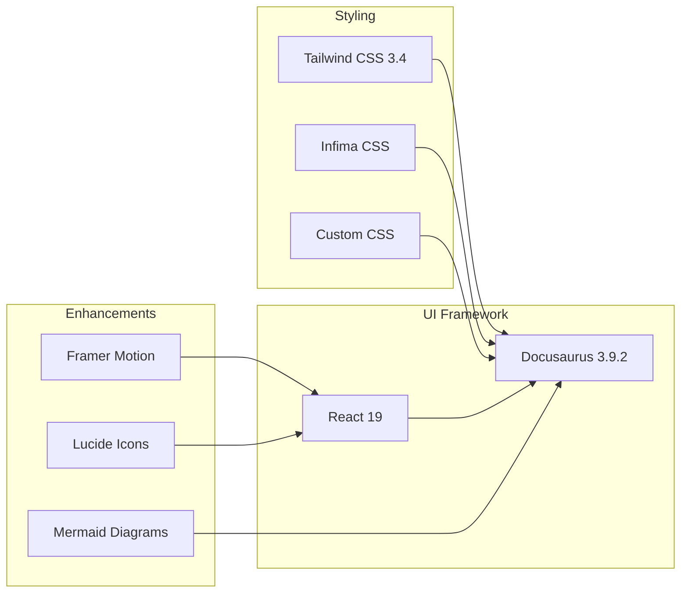

# System Architecture

This document describes the technical architecture of the Vietnamese Aiken documentation site, including system diagrams, data flows, and deployment architecture.

---

## System Architecture Overview


---

## Technology Stack Overview

### Frontend Stack



### Build Stack

| Layer | Technology | Purpose |
|-------|------------|---------|
| Build Tool | Docusaurus CLI | Static site generation |
| CSS Processing | PostCSS + Tailwind | Utility class compilation |
| JS Bundling | Webpack (internal) | Module bundling |
| Transpilation | Babel | JavaScript/TypeScript compilation |
| Optimization | Terser + CSS Nano | Production minification |

---

## Component Architecture


---

## Data Flow Architecture

### Analytics Data Flow


### Analytics Data Structure

```typescript
interface AccessLog {
  sessionId: string;           // Unique session identifier
  eventType: string;           // 'page_view' | 'page_exit' | 'page_hidden' | 'page_visible'
  timestamp: Timestamp;        // Firebase server timestamp
  clientTimestamp: string;     // ISO date string
  page: {
    url: string;               // Full URL
    pathname: string;          // Path only
    search: string;            // Query parameters
    hash: string;              // URL hash
    title: string;             // Page title
    referrer: string | null;   // Referring page
  };
  browser: {
    userAgent: string;         // Browser user agent
    language: string;          // Browser language
    platform: string;          // OS platform
    screenWidth: number;       // Screen dimensions
    screenHeight: number;
    viewportWidth: number;     // Viewport dimensions
    viewportHeight: number;
  };
  ipAddress?: string;          // User IP (if available)
  timeOnPage?: number;         // Seconds (for exit events)
}
```

---

## Deployment Architecture

### GitHub Pages Deployment

```mermaid
graph LR
    subgraph "Development"
        Dev[Local Development]
        Branch[Feature Branch]
    end

    subgraph "CI/CD Pipeline"
        Push[Git Push]
        Validate[Validate Job]
        Build[Build Job]
        Artifact[Build Artifact]
    end

    subgraph "Hosting"
        GHP[GitHub Pages]
        CDN[GitHub CDN]
    end

    subgraph "Users"
        Users[End Users]
    end

    Dev --> Branch
    Branch --> Push
    Push --> Validate
    Validate --> Build
    Build --> Artifact
    Artifact --> GHP
    GHP --> CDN
    CDN --> Users
```

### CI/CD Pipeline Details


### Deployment Configuration

| Setting | Value |
|---------|-------|
| Organization | uberhub-mentorias |
| Repository | docusaurus |
| Branch | main |
| Build Output | `build/` |
| Base URL | `/` |
| URL | https://uberhub-mentorias.github.io |

---

## Content Architecture

### Documentation Hierarchy


### Sidebar Generation


The sidebar is auto-generated based on:
1. Directory structure (numeric prefix for ordering)
2. `sidebar_position` frontmatter field
3. `title` frontmatter field for display

---

## Integration Points

### External Service Integrations

| Service | Purpose | Integration Method |
|---------|---------|-------------------|
| Firebase Firestore | Analytics storage | JavaScript SDK |
| ipify.org | IP geolocation | REST API |
| GitHub Pages | Static hosting | Automatic deployment |
| GitHub Actions | CI/CD | YAML workflow |

### Firebase Configuration

```javascript
const firebaseConfig = {
  apiKey: "...",
  authDomain: "mentorias-uberhub.firebaseapp.com",
  projectId: "mentorias-uberhub",
  storageBucket: "mentorias-uberhub.firebasestorage.app",
  messagingSenderId: "...",
  appId: "..."
};
```

**Firestore Collections:**

| Collection | Purpose | Write | Read |
|------------|---------|-------|------|
| `access_logs` | Page view analytics | Client | Admin only |

---

## Security Considerations

### Client-Side Security

| Concern | Mitigation |
|---------|------------|
| Firebase API key exposure | Restricted to specific domains in Firebase console |
| XSS attacks | React's built-in escaping, no `dangerouslySetInnerHTML` |
| Data validation | Firebase security rules restrict writes |

### Firestore Security Rules

```javascript
rules_version = '2';
service cloud.firestore {
  match /databases/{database}/documents {
    // Access logs - write only, no read
    match /access_logs/{logId} {
      allow write: if true;
      allow read: if false;
    }
  }
}
```

### Build Security

| Measure | Implementation |
|---------|----------------|
| Contributor validation | CI pipeline checks GitHub actor |
| Dependency security | npm ci (locked versions) |
| Build isolation | GitHub Actions runners |

---

## Performance Considerations

### Static Site Optimization

| Optimization | Implementation |
|--------------|----------------|
| Static Generation | Pre-built HTML at build time |
| Code Splitting | Automatic via Webpack |
| Asset Optimization | Compressed images, minified CSS/JS |
| CDN Delivery | GitHub Pages global CDN |

### Runtime Performance

| Optimization | Implementation |
|--------------|----------------|
| Lazy Loading | React.lazy for components |
| Animation Performance | Framer Motion with GPU acceleration |
| Reduced Motion | CSS media query support |
| Image Loading | Lazy loading with loading="lazy" |

### Bundle Size Management

| Package | Size Impact | Justification |
|---------|-------------|---------------|
| React | ~40KB | Core framework |
| Framer Motion | ~30KB | Essential animations |
| Firebase | ~50KB | Analytics requirement |
| Tailwind (purged) | ~10KB | Utility CSS |

---

## Monitoring and Observability

### Analytics Dashboard

Data available in Firebase Console:
- Page view counts
- Session duration
- Geographic distribution
- Device/browser breakdown
- Popular content

### Build Monitoring

GitHub Actions provides:
- Build success/failure status
- Build duration metrics
- Artifact storage
- Workflow run history

---

## Scalability Considerations

### Current Scale

| Metric | Current Capacity |
|--------|------------------|
| Content | 25 documentation pages |
| Static Files | ~10MB build output |
| Monthly Bandwidth | GitHub Pages free tier |
| Analytics Writes | Firebase free tier (50K/day) |

### Growth Path

| Scale Milestone | Recommended Actions |
|-----------------|---------------------|
| 100+ pages | Add search functionality |
| 10K+ monthly users | Consider Firebase paid tier |
| Multi-language | Enable i18n (already configured) |
| Video content | Consider external video hosting |

---

## Related Documentation

- [Project Overview and PDR](./project-overview-pdr.md)
- [Codebase Summary](./codebase-summary.md)
- [Code Standards](./code-standards.md)
