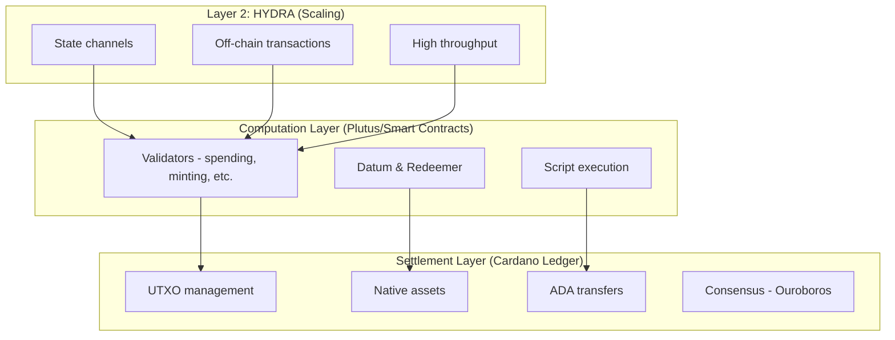

# Bài 01: Giới Thiệu về Cardano

:::info Mục tiêu
Hiểu tổng quan về Cardano blockchain, kiến trúc, các thành phần chính, và tại sao Cardano phù hợp cho smart contract development.
:::

---

## 1. Cardano là gì?

### Tổng quan

Cardano là blockchain thế hệ thứ 3 (3rd generation), được phát triển dựa trên nghiên cứu học thuật và formal verification.

| Thế hệ | Blockchain | Đặc điểm chính |
|--------|------------|----------------|
| Generation 1 | Bitcoin | Digital currency, Simple transactions |
| Generation 2 | Ethereum | Smart contracts, DApps, Account-based model |
| Generation 3 | Cardano | Scalability (Hydra, sidechains), Sustainability (Treasury), Interoperability, Formal verification, Extended UTXO model |

### Đặc điểm nổi bật

| Đặc điểm | Mô tả |
|----------|-------|
| **Proof of Stake** | Ouroboros - PoS protocol được chứng minh toán học |
| **Research-driven** | Peer-reviewed academic research |
| **Formal Methods** | Smart contracts có thể verified mathematically |
| **Native Assets** | Tokens được xử lý như ADA (không cần smart contract) |
| **eUTXO** | Extended UTXO model - mạnh hơn Bitcoin UTXO |
| **Deterministic** | Biết trước kết quả transaction trước khi submit |
| **Low Fees** | Phí transaction thấp và ổn định |

### Nguyên tắc thiết kế

Cardano được thiết kế dựa trên 4 nguyên tắc cốt lõi:

**1. SCALABILITY**
- Hydra (Layer 2)
- Sidechains
- Pipelining

**2. INTEROPERABILITY**
- Cross-chain bridges
- Sidechains communication
- Standard protocols

**3. SUSTAINABILITY**
- Treasury system
- On-chain governance
- Community voting (Catalyst)

**4. SECURITY**
- Formal verification
- Peer-reviewed protocols
- Deterministic execution

---

## 2. Kiến Trúc Cardano

### Layered Architecture

Cardano sử dụng kiến trúc phân lớp để tách biệt các chức năng:



### Node Architecture

| Component | Chức năng |
|-----------|-----------|
| **Consensus (Ouroboros)** | Đồng thuận và xác nhận block |
| **Network (mini-protocol)** | Giao tiếp giữa các node |
| **Ledger (Chain state)** | Trạng thái blockchain |
| **Mempool (Pending txs)** | Giao dịch chờ xử lý |
| **Storage (ChainDB)** | Lưu trữ blocks, UTXOs, ledger snapshots |

### Transaction Flow

Vòng đời của một giao dịch trong Cardano:

| Bước | Thành phần | Hành động |
|------|------------|-----------|
| 1. BUILD | Wallet | Construct transaction (inputs, outputs, scripts) |
| 2. SIGN | Wallet | Add signatures (witness set) |
| 3. SUBMIT | Node | Validate & add to mempool |
| 4. PROPAGATE | Network | Spread to other nodes |
| 5. INCLUDE IN BLOCK | Stake Pool | Block producer includes tx |
| 6. CONFIRM | Chain | Transaction confirmed (after sufficient blocks) |

---

## 3. Các Thành Phần Chính

### ADA - Native Currency

ADA là native currency của Cardano.

**Units:**
- 1 ADA = 1,000,000 Lovelace
- Lovelace là đơn vị nhỏ nhất (như Satoshi của Bitcoin)

**Uses:**
- Transaction fees
- Staking rewards
- Governance voting
- Smart contract collateral
- Min UTXO requirement

:::tip Min UTXO
Mỗi UTXO cần minimum ADA, tùy thuộc vào kích thước datum. Thường ~1-2 ADA cho UTXO đơn giản.
:::

### Addresses

Cardano address bao gồm Payment Part và Stake Part (optional).

**Payment Credential:**
- VerificationKey (public key hash)
- Script (validator hash)

**Stake Credential (optional):**
- VerificationKey (stake key hash)
- Script (stake validator hash)

**Address Types:**

| Type | Mô tả |
|------|-------|
| Base Address | payment + stake credentials |
| Enterprise Address | payment only (no staking) |
| Pointer Address | payment + stake pool pointer |
| Reward Address | for staking rewards |

**Example (Bech32 encoding):**
- `addr1qx...xyz` (mainnet)
- `addr_test1qx...xyz` (testnet)

### Scripts (Validators)

| Loại Script | Chức năng |
|-------------|-----------|
| **SPENDING VALIDATOR** | Controls spending of UTXOs, Locked at script address, Requires datum & redeemer |
| **MINTING POLICY** | Controls token minting/burning, Identified by Policy ID, Requires redeemer |
| **STAKING VALIDATOR (WITHDRAW)** | Controls reward withdrawal, Delegates stake |
| **CERTIFYING VALIDATOR (PUBLISH)** | Controls stake certificates, Register/deregister stake |
| **VOTING VALIDATOR (CIP-1694)** | On-chain governance, DRep voting |
| **PROPOSING VALIDATOR (CIP-1694)** | Governance proposals |

### Transactions

Transaction structure trong Cardano:

```
Transaction {
  // === INPUTS ===
  inputs: List<Input>,          // UTXOs to spend
  reference_inputs: List<Input>, // Read-only UTXOs

  // === OUTPUTS ===
  outputs: List<Output>,        // New UTXOs to create

  // === VALUE ===
  fee: Lovelace,                // Transaction fee
  mint: Value,                  // Tokens to mint/burn

  // === CERTIFICATES ===
  certificates: List<Certificate>, // Stake operations
  withdrawals: Map<Address, Int>,  // Reward withdrawals

  // === TIME ===
  validity_range: Interval,     // Valid time window

  // === WITNESSES ===
  extra_signatories: List<PubKeyHash>, // Required signers
  redeemers: Map<Purpose, Redeemer>,   // Script inputs
  datums: Map<Hash, Data>,             // Datum lookup

  // === METADATA ===
  id: TransactionId,            // Tx hash
}
```

---

## 4. Eras và Hard Forks

### Cardano Evolution

| Era | Năm | Tính năng chính |
|-----|-----|-----------------|
| **BYRON** | 2017-2020 | Initial launch, Basic transfers, Federated block production |
| **SHELLEY** | 2020 | Proof of Stake (Ouroboros), Stake pools, Delegation, Decentralization |
| **ALLEGRA** | 2020 | Token locking, Time-lock scripts |
| **MARY** | 2021 | Native tokens (multi-asset), NFTs support |
| **ALONZO** | 2021 | Smart contracts (Plutus V1), Spending validators, Minting policies |
| **BABBAGE** | 2022 | Plutus V2, Reference inputs, Inline datums, Reference scripts, CIP-31, 32, 33 |
| **CONWAY** | 2024 | On-chain governance (CIP-1694), DReps, Constitutional Committee, Treasury withdrawals, Plutus V3 |

### Plutus Versions

| Version | Era | Tính năng |
|---------|-----|-----------|
| **PLUTUS V1** | Alonzo | Basic smart contracts, Spending validators, Minting policies, Limited script context |
| **PLUTUS V2** | Babbage | Reference inputs (read without spending), Inline datums (no separate datum hash), Reference scripts (reusable scripts), More script context info, Cost model improvements |
| **PLUTUS V3** | Conway | Governance actions, Voting validators, Proposing validators, New crypto primitives (BLS signatures, Keccak-256, Blake2b-224), Sums of products (better encoding) |

---

## 5. Native Assets

### Multi-Asset Ledger

Cardano supports NATIVE tokens (không cần smart contract).

**Asset Identification:**

```
PolicyId + AssetName = Unique Token

- PolicyId: Hash of minting policy (28 bytes)
- AssetName: Token name (0-32 bytes)

Special case: ADA
- PolicyId: "" (empty)
- AssetName: "" (empty)
```

**Token Types:**

| Loại | Đặc điểm | Ví dụ |
|------|----------|-------|
| **Fungible Token (FT)** | Multiple units với cùng PolicyId + AssetName | Stablecoins, utility tokens |
| **Non-Fungible Token (NFT)** | Chỉ 1 unit tồn tại, One-shot minting policy | Art, collectibles, identity |

### Value Structure

```aiken
// Trong Aiken, Value đại diện cho multi-asset values

use cardano/assets.{Value, PolicyId, AssetName}

// Value = Map<PolicyId, Map<AssetName, Int>>

fn value_example() {
  // ADA only
  let ada_value = assets.from_lovelace(5_000_000)

  // Get lovelace amount
  let lovelace = assets.lovelace_of(ada_value)

  // Check specific token
  let token_qty = assets.quantity_of(
    some_value,
    my_policy_id,
    my_asset_name,
  )

  // Merge values
  let combined = assets.merge(value1, value2)

  // Flatten to list
  let flat = assets.flatten(some_value)
  // Returns: List<(PolicyId, AssetName, Int)>
}
```

---

## 6. So Sánh với Ethereum

### Account vs UTXO Model

| Aspect | Ethereum (Account Model) | Cardano (UTXO Model) |
|--------|--------------------------|----------------------|
| **State** | Global, mutable | Local, immutable |
| **Identity** | Account address | UTXO references |
| **Balance** | Single number | Sum of UTXOs |
| **Transfer** | Deduct from sender, Add to receiver, Update single state | Consume UTXO(s), Create new UTXO(s), No global state change |
| **Smart Contract** | Mutable state, Sequential execution, Gas estimation complex, Reentrancy attacks | Stateless validator, Parallel execution, Deterministic costs, No reentrancy |

### Comparison Table

| Feature | Ethereum | Cardano |
|---------|----------|---------|
| **Model** | Account-based | UTXO-based (eUTXO) |
| **State** | Global mutable state | Local UTXO state |
| **Execution** | Sequential | Parallel possible |
| **Fees** | Variable gas | Predictable |
| **Tokens** | ERC-20 contracts | Native assets |
| **Language** | Solidity (imperative) | Plutus/Aiken (functional) |
| **Verification** | Audits | Formal verification |
| **Determinism** | Non-deterministic | Deterministic |
| **Reentrancy** | Possible | Not possible |

### Security Advantages

Cardano có nhiều lợi thế về bảo mật:

**1. DETERMINISM**
- Know exact outcome before submitting
- No failed transactions (except consumed UTXOs)
- Predictable fees

**2. NO REENTRANCY**
- UTXO model prevents reentrancy attacks
- Each UTXO can only be spent once
- No recursive calls to contracts

**3. LOCAL VALIDATION**
- Validators only see relevant transaction data
- Cannot be affected by other contracts
- Isolated execution

**4. FORMAL VERIFICATION**
- Functional programming enables proofs
- Mathematical guarantees
- Fewer unexpected behaviors

---

## 7. Development Ecosystem

### Development Tools

**SMART CONTRACT LANGUAGES**

| Ngôn ngữ | Đặc điểm |
|----------|----------|
| **Aiken** (recommended!) | Modern, fast, easy to learn. Designed specifically for Cardano |
| **Plutus-Tx** (Haskell) | Original language, Full Haskell ecosystem |
| **Opshin** (Python) | Python syntax, Lower barrier to entry |
| **Plu-ts** (TypeScript) | TypeScript for Plutus |

**OFF-CHAIN / FRONTEND**

| Library | Đặc điểm |
|---------|----------|
| **Mesh.js** | JavaScript/TypeScript SDK, Transaction building, Wallet integration |
| **Lucid / Lucid Evolution** | TypeScript library, Lightweight |
| **cardano-serialization-lib** | Low-level serialization |
| **PyCardano** | Python library |

**INFRASTRUCTURE**

| Service | Đặc điểm |
|---------|----------|
| **Blockfrost** | API service, No node required |
| **Koios** | Distributed API, Community-run |
| **Ogmios** | WebSocket bridge to node |
| **Kupo** | Chain indexer, UTXO lookup |

**TESTING**
- Preview Testnet
- Preprod Testnet
- Local devnet (yaci-devkit)

### Resources

**Official Documentation:**
- https://docs.cardano.org
- https://aiken-lang.org
- https://developers.cardano.org

**Explorers:**
- https://cardanoscan.io
- https://cexplorer.io
- https://pool.pm

**Community:**
- Cardano Forum
- Discord servers
- Reddit r/cardano

**APIs:**
- https://blockfrost.io
- https://koios.rest

---

## Tài Liệu Tham Khảo

- [Cardano Documentation](https://docs.cardano.org)
- [Cardano Developer Portal](https://developers.cardano.org)
- [Ouroboros Protocol](https://cardano.org/ouroboros)
- [CIP Repository](https://cips.cardano.org)

---

**Bài tiếp theo:** [02. Mô Hình UTXO](./02_utxo_model.md)
