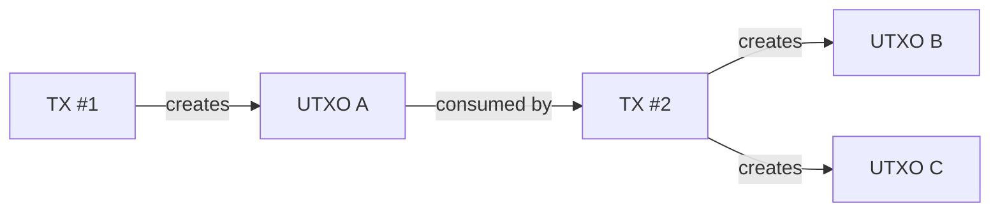
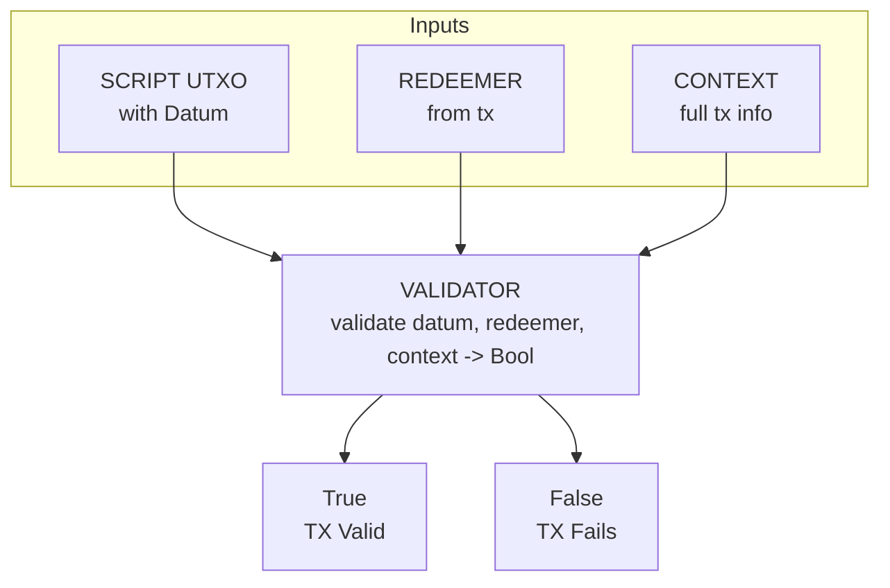
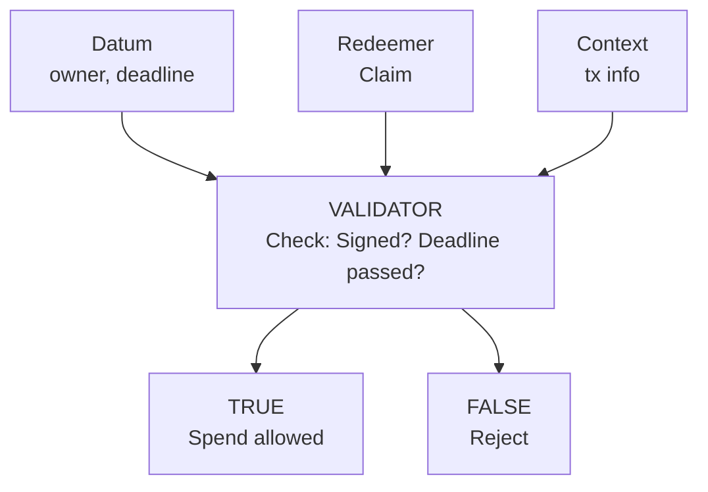

# Bài 02: Mô Hình UTXO

:::info Mục tiêu
Hiểu sâu về UTXO và Extended UTXO (eUTXO) model trong Cardano, cách transactions hoạt động, và tại sao eUTXO mạnh hơn cho smart contracts.
:::

---

## 1. UTXO là gì?

### Định nghĩa

**UTXO = Unspent Transaction Output** (Đầu ra giao dịch chưa được tiêu)

UTXO giống như tờ tiền trong ví:

| Ví tiền mặt | Cardano wallet |
|-------------|----------------|
| $50 bill | UTXO#1: 50 ADA |
| $20 bill | UTXO#2: 20 ADA |
| $10 bill | UTXO#3: 10 ADA |
| $5 bill | UTXO#4: 5 ADA |
| **Total: $85** | **Total: 85 ADA** |

:::tip Key insight
Không có "balance" thực sự. Balance = Tổng tất cả UTXOs bạn sở hữu.
:::

### UTXO Structure

Mỗi UTXO bao gồm:

| Component | Mô tả |
|-----------|-------|
| **OutputReference (ID)** | TransactionId (hash của tx tạo ra nó) + OutputIndex (vị trí trong outputs) |
| **Address** | Ai sở hữu UTXO |
| **Value** | ADA + tokens |
| **Datum** | Data cho smart contracts |
| **ReferenceScript** | Optional script đính kèm |

**Ví dụ:**
```
OutputReference:
  TxId: abc123...def
  Index: 0

Output:
  Address: addr1qxy...
  Value: 100 ADA + 50 MyToken
  Datum: { owner: "alice", deadline: 1700000 }
```

### UTXO Lifecycle

| Phase | Mô tả |
|-------|-------|
| **1. CREATION (Birth)** | Transaction creates outputs -> New UTXOs |
| **2. EXISTENCE (Life)** | UTXO exists on chain, can be queried. "Unspent" - chưa được dùng |
| **3. CONSUMPTION (Death)** | Transaction uses UTXO as input -> UTXO destroyed. UTXO becomes "spent" |



:::warning Rule
UTXOs can only be spent ONCE (Double-spend prevention built into model)
:::

---

## 2. So Sánh Account vs UTXO

### Account Model (Ethereum)

**Global State:**
```
Account 0xABC: Balance = 100 ETH, Nonce = 5
Account 0xDEF: Balance = 50 ETH, Nonce = 3
Contract 0x123: Storage = {...}
```

**Transfer 30 ETH from 0xABC to 0xDEF:**

| Before | After |
|--------|-------|
| 0xABC: 100 ETH | 0xABC: 70 ETH (100 - 30) |
| 0xDEF: 50 ETH | 0xDEF: 80 ETH (50 + 30) |

**Characteristics:**
- Simple mental model
- Easy balance queries
- Global state contention
- Sequential execution required
- Reentrancy attacks possible
- Non-deterministic gas

### UTXO Model (Cardano)

**UTXO Set:**
```
UTXO#1: 60 ADA at addr1_alice
UTXO#2: 40 ADA at addr1_alice
UTXO#3: 50 ADA at addr1_bob
```

**Transfer 30 ADA from Alice to Bob:**

```
Transaction:
  Inputs:
    - UTXO#2 (40 ADA) [CONSUMED]

  Outputs:
    - 30 ADA to addr1_bob    [NEW UTXO#4]
    - 10 ADA to addr1_alice  [NEW UTXO#5] (change)

  Fee: ~0.17 ADA
```

**After:**
```
UTXO#1: 60 ADA at addr1_alice  (unchanged)
UTXO#4: 30 ADA at addr1_bob    (new)
UTXO#5: ~10 ADA at addr1_alice (change)
UTXO#3: 50 ADA at addr1_bob    (unchanged)
```

**Characteristics:**
- No global state
- Parallel execution possible
- No reentrancy
- Deterministic fees
- Change handling required
- UTXO selection complexity

### Comparison Summary

| Aspect | Account Model | UTXO Model |
|--------|---------------|------------|
| **State** | Global, mutable | Local, immutable |
| **Identity** | Account address | UTXO references |
| **Balance** | Single number | Sum of UTXOs |
| **Transactions** | Modify accounts | Consume & create UTXOs |
| **Parallelism** | Limited | High potential |
| **Privacy** | Lower | Higher (new addresses) |
| **Complexity** | Simpler for users | Change management |

---

## 3. Extended UTXO (eUTXO)

### What Makes eUTXO "Extended"?

**BITCOIN UTXO (Simple):**
- Value (Satoshis only)
- Locking Script (simple conditions): P2PKH (Require signature), P2SH (Hash of script)
- Limited programmability

**CARDANO eUTXO (Extended):**
- Value (ADA + Native Tokens)
- Address (with Script Hash)
- **DATUM (arbitrary data)** - NEW
- **Reference Script (optional)** - NEW

**Transaction has:**
- **REDEEMER (for each script input)** - NEW
- **Full SCRIPT CONTEXT** - NEW: All inputs, All outputs, Validity range, Signatories, Minting info

:::tip
Extensions enable SMART CONTRACTS!
:::

### eUTXO Components

**1. DATUM (Data attached to UTXO)**
- Arbitrary data structure
- Stored on-chain with UTXO
- Defines "state" of the contract
- Examples:
  - Vesting: `{ owner, beneficiary, deadline }`
  - DEX: `{ token_a, token_b, price }`
  - NFT: `{ metadata_hash, royalty }`

**2. REDEEMER (Action/Proof to spend UTXO)**
- Provided when spending script UTXO
- Specifies "action" to perform
- Passed to validator
- Examples:
  - Vesting: `Claim | Cancel`
  - DEX: `Swap { amount } | AddLiquidity`
  - Auction: `Bid { amount } | Close`

**3. VALIDATOR (Smart Contract)**
- Pure function: `(Datum, Redeemer, Context) -> Bool`
- Returns True = Transaction valid
- Returns False/Fails = Transaction rejected
- Runs for EACH script input

**4. SCRIPT CONTEXT (Transaction info)**
- Full transaction data
- All inputs and outputs
- Minting information
- Validity time range
- Signatures present
- Own UTXO reference

### eUTXO Execution Model



---

## 4. Transaction Anatomy

### Complete Transaction Structure

```
Transaction {

  // INPUTS (UTXOs to consume)
  inputs: [
    { tx_id: "abc...", index: 0 },  // UTXO ref
    { tx_id: "def...", index: 2 },
  ]

  reference_inputs: [  // Read-only (Plutus V2)
    { tx_id: "ghi...", index: 0 },
  ]

  // OUTPUTS (New UTXOs to create)
  outputs: [
    {
      address: "addr1...",
      value: { lovelace: 5000000, tokens: {...} },
      datum: InlineDatum({...}) | DatumHash(...),
      reference_script: None | Some(script),
    },
    { ... },  // More outputs
  ]

  // MINTING
  mint: {
    "policy_id_1": { "TokenA": 100, "TokenB": -5 },
    "policy_id_2": { "NFT": 1 },
  }

  // VALIDITY & METADATA
  fee: 200000,  // Lovelace

  validity_range: {
    lower: 1700000000,  // POSIX time (optional)
    upper: 1700100000,  // POSIX time (optional)
  }

  extra_signatories: [
    "pkh_1...",  // Required signatures
    "pkh_2...",
  ]

  // WITNESSES (Proofs)
  redeemers: {
    (Spend, 0): { data: Claim, budget: ... },
    (Mint, policy_id): { data: {...}, budget },
  }

  datums: {
    "hash_1": { owner: "...", deadline: ... },
  }

  signatures: [...]  // Key signatures
}
```

### Validation Rules

A transaction is valid if ALL of these hold:

| Category | Rules |
|----------|-------|
| **INPUT VALIDATION** | All inputs exist (UTXOs not already spent), For wallet inputs: valid signature present, For script inputs: validator returns True |
| **VALUE PRESERVATION** | sum(inputs) = sum(outputs) + fee + burned, No value created from nothing (except minting), All outputs have minimum ADA |
| **MINTING VALIDATION** | For each policy: minting policy returns True, Mint amount matches what's in outputs |
| **TIME VALIDATION** | Current slot within validity_range |
| **SIGNATURE VALIDATION** | All required signatures present, Signatures are valid |
| **BUDGET VALIDATION** | Script execution within CPU budget, Script execution within memory budget, Fee covers execution cost |

---

## 5. UTXO Selection

### The Change Problem

**Problem: Send exactly 25 ADA**

**Available UTXOs:**
- UTXO A: 50 ADA
- UTXO B: 20 ADA
- UTXO C: 10 ADA
- UTXO D: 5 ADA

**Option 1: Use UTXO A (50 ADA)**
| Item | Value |
|------|-------|
| Input | 50 ADA |
| Output | 25 ADA (recipient) |
| Change | 25 ADA - fee (back to sender) |
| Fee | ~0.17 ADA |

**Option 2: Use UTXO B + C (30 ADA)**
| Item | Value |
|------|-------|
| Inputs | 20 + 10 = 30 ADA |
| Output | 25 ADA (recipient) |
| Change | 5 ADA - fee |
| Fee | ~0.18 ADA (slightly higher - more inputs) |

**Option 3: Use UTXO B + D (25 ADA) - exact!**
| Item | Value |
|------|-------|
| Inputs | 20 + 5 = 25 ADA |
| Output | 25 - fee ADA (recipient) |
| Change | None needed! |
| Fee | ~0.18 ADA |

### Selection Strategies

| Strategy | Mô tả |
|----------|-------|
| **LARGEST FIRST** | Select largest UTXOs first. Fewer inputs = lower fees. May create "dust" (small change) |
| **SMALLEST FIRST** | Consolidate small UTXOs. Clean up wallet. Higher fees (more inputs) |
| **RANDOM** | Better privacy. Less predictable |
| **OPTIMIZED (Coin Selection)** | Balance between fee and change. Avoid creating dust. CIP-2 algorithms |

**Considerations:**
- Min UTXO requirement (~1 ADA)
- Token bundling (tokens must have ADA carrier)
- Fee calculation
- Privacy implications

---

## 6. Script Execution Flow

### Complete Flow Diagram

**STEP 1: Lock funds at script address**

```
User --TX--> Script Address
                 |
                 v
           +---------+
           |  UTXO   |
           | 100 ADA |
           | Datum: {|
           |  owner, |
           |  deadline|
           | }       |
           +---------+
```

**STEP 2: Build spending transaction**

```
Transaction:
  - Input: Script UTXO
  - Redeemer: Claim
  - Output: 99.8 ADA to beneficiary
  - Validity: after deadline
  - Signatories: [beneficiary_pkh]
```

**STEP 3: Validator execution**



### Aiken Implementation

```aiken
use cardano/transaction.{Transaction, OutputReference}
use aiken/collection/list

/// Datum - stored with UTXO
type VestingDatum {
  owner: ByteArray,
  beneficiary: ByteArray,
  deadline: Int,
}

/// Redeemer - provided when spending
type VestingRedeemer {
  Claim
  Cancel
}

/// Validator
validator vesting {
  spend(
    datum: Option<VestingDatum>,
    redeemer: VestingRedeemer,
    _own_ref: OutputReference,
    tx: Transaction,
  ) {
    // Extract datum
    expect Some(d) = datum

    // Get transaction info
    let signatories = tx.extra_signatories
    let valid_after = get_validity_start(tx)

    // Check based on action
    when redeemer is {
      Claim -> {
        // Beneficiary must sign
        let beneficiary_signed = list.has(signatories, d.beneficiary)
        // Must be after deadline
        let deadline_passed = valid_after > d.deadline

        beneficiary_signed && deadline_passed
      }

      Cancel -> {
        // Owner must sign
        let owner_signed = list.has(signatories, d.owner)
        // Must be before deadline
        let before_deadline = valid_after <= d.deadline

        owner_signed && before_deadline
      }
    }
  }
}

fn get_validity_start(tx: Transaction) -> Int {
  when tx.validity_range.lower_bound.bound_type is {
    Finite(time) -> time
    _ -> 0
  }
}
```

---

## 7. Patterns và Best Practices

### Common Patterns

| Pattern | Mô tả |
|---------|-------|
| **STATE MACHINE** | Datum represents state, Redeemer represents transition, Validator checks valid transitions, Output continues the state |
| **ONE-SHOT (NFT/Unique tokens)** | Consume specific UTXO (by reference), Can only happen once, Used for NFTs, unique identifiers |
| **MULTI-SIG** | Require multiple signatures, Check signatories in context, Threshold validation |
| **TIME-LOCKED** | Check validity_range, Unlock after deadline, Vesting, escrow patterns |
| **ORACLE** | Reference input with oracle data, Validator reads but doesn't consume, Price feeds, external data |
| **THREAD TOKEN** | Unique NFT identifies valid state, Must be present in continuing output, Prevents state duplication |

### Best Practices

:::tip DO's (Nen lam)
- Validate ALL inputs thoroughly
- Check datum exists before using
- Verify continuing outputs for state machines
- Use reference inputs to reduce costs
- Consider UTXO contention for high-traffic contracts
- Test with various UTXO configurations
:::

:::warning DON'Ts (Khong nen lam)
- Assume single UTXO per address
- Ignore min UTXO requirements
- Forget change outputs
- Overlook token bundling with ADA
- Create too small UTXOs (dust)
- Ignore concurrent access issues
:::

---

## Bài Tập Thực Hành

### Bài 1: Analyze Transaction

1. Tìm một transaction trên cardanoscan.io
2. Identify:
   - Inputs (UTXOs consumed)
   - Outputs (UTXOs created)
   - Change output
   - Fee

### Bài 2: UTXO Selection

Given UTXOs: [100, 50, 30, 20, 10, 5] ADA

Calculate optimal selection for sending:
- 45 ADA
- 80 ADA
- 15 ADA

### Bài 3: Trace Script Execution

```aiken
// Walk through this validator manually:
// Datum: { owner: "alice", deadline: 1000 }
// Redeemer: Claim
// Context: { signatories: ["bob"], time: 1500 }
// What happens?
```

---

## Checklist Hoàn Thành

- [ ] Hiểu UTXO concept và lifecycle
- [ ] So sánh được Account vs UTXO model
- [ ] Nắm vững eUTXO extensions (datum, redeemer)
- [ ] Hiểu transaction structure
- [ ] Biết UTXO selection strategies
- [ ] Hiểu script execution flow
- [ ] Biết common patterns và best practices

---

## Tài Liệu Tham Khảo

- [Cardano eUTXO Handbook](https://docs.cardano.org/plutus/eutxo-explainer)
- [Understanding UTXOs](https://developers.cardano.org/docs/stake-pool-course/handbook/utxo-model/)
- [CIP-2: Coin Selection](https://cips.cardano.org/cips/cip2/)

---

**Bài tiếp theo:** [03. Datum & Redeemer](./03_datum_redeemer.md)
