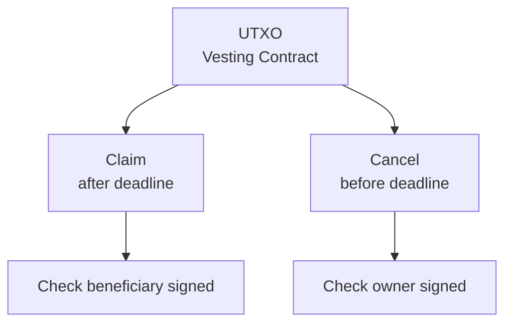

# Bài 03: Datum & Redeemer

:::info Mục tiêu
Hiểu sâu về Datum và Redeemer - hai thành phần cốt lõi của smart contracts trong Cardano, cách thiết kế và sử dụng hiệu quả.
:::

---

## 1. Tổng Quan Datum & Redeemer

### Vai trò trong Smart Contracts

Trong Cardano smart contracts:

| Component | Vai trò | Mô tả |
|-----------|---------|-------|
| **DATUM** | "What" (State/Data) | Stored WITH the UTXO, Represents contract state, Immutable once created, Read by validator |
| **REDEEMER** | "How" (Action/Proof) | Provided IN the transaction, Specifies action to perform, Can contain parameters, Triggers specific logic |
| **CONTEXT** | "Where" (Environment) | Full transaction information, Inputs, outputs, signers, Time validity |

**Validator Function:**
```
validate(datum, redeemer, context) -> Bool

"Given this STATE (datum),
 can this ACTION (redeemer)
 be performed in this CONTEXT?"
```

### Lifecycle

**PHASE 1: LOCK (Create UTXO)**
- User creates transaction
- Output to script address
- Attach DATUM (inline or hash)
- No redeemer needed yet
- Result: UTXO created at script address with datum attached

**PHASE 2: UTXO EXISTS (On-chain)**
```
+------------------------+
|  Script UTXO           |
|  - Value: 100 ADA      |
|  - Address: script_addr|
|  - Datum: {            |
|      owner: "alice",   |
|      deadline: 1700... |
|    }                   |
+------------------------+
```

**PHASE 3: UNLOCK (Spend UTXO)**
- User creates spending transaction
- Input: the script UTXO
- Provide REDEEMER (action)
- Validator executed with (datum, redeemer, ctx)
- Result: If validator returns True, UTXO is spent

---

## 2. Datum - Contract State

### Datum Types

**1. INLINE DATUM (Plutus V2+) - Recommended**

UTXO contains full datum data.

| Pros | Cons |
|------|------|
| No separate lookup needed | Larger UTXO size |
| Datum always available | Higher min ADA requirement |
| Simpler transaction building | |

**2. DATUM HASH (Legacy)**

UTXO contains only hash of datum. Actual datum provided in transaction.

| Pros | Cons |
|------|------|
| Smaller UTXO size | Must track datum off-chain |
| Lower min ADA | Datum can be "lost" |
| | More complex transactions |

**3. NO DATUM**

UTXO has no datum. Used for simple scripts (no state needed).

### Defining Datums in Aiken

```aiken
// ========== SIMPLE DATUMS ==========

/// Basic vesting datum
type VestingDatum {
  /// Owner who can cancel
  owner: ByteArray,
  /// Beneficiary who can claim
  beneficiary: ByteArray,
  /// Deadline (POSIX timestamp in milliseconds)
  deadline: Int,
}

/// Simple lock datum
type LockDatum {
  /// Required signer to unlock
  key_hash: ByteArray,
}

// ========== COMPLEX DATUMS ==========

/// DEX liquidity pool datum
type PoolDatum {
  /// Token A identifier
  token_a: AssetClass,
  /// Token B identifier
  token_b: AssetClass,
  /// Reserve of token A
  reserve_a: Int,
  /// Reserve of token B
  reserve_b: Int,
  /// LP token policy
  lp_token: AssetClass,
  /// Total LP tokens minted
  total_lp: Int,
  /// Fee numerator (e.g., 3 for 0.3%)
  fee_num: Int,
  /// Fee denominator (e.g., 1000)
  fee_den: Int,
}

/// Auction datum
type AuctionDatum {
  /// Seller address
  seller: ByteArray,
  /// Item being auctioned
  asset: AssetClass,
  /// Minimum bid amount
  min_bid: Int,
  /// Current highest bid (if any)
  highest_bid: Option<Bid>,
  /// Auction deadline
  deadline: Int,
}

type Bid {
  bidder: ByteArray,
  amount: Int,
}

/// Asset identifier
type AssetClass {
  policy_id: ByteArray,
  asset_name: ByteArray,
}

// ========== NESTED DATUMS ==========

/// Order book datum with nested types
type OrderDatum {
  /// Order details
  order: OrderDetails,
  /// Execution constraints
  constraints: OrderConstraints,
  /// Metadata
  metadata: OrderMetadata,
}

type OrderDetails {
  maker: ByteArray,
  sell_asset: AssetClass,
  sell_amount: Int,
  buy_asset: AssetClass,
  buy_amount: Int,
}

type OrderConstraints {
  min_fill: Int,
  allow_partial: Bool,
  deadline: Option<Int>,
}

type OrderMetadata {
  created_at: Int,
  order_id: ByteArray,
}
```

### Accessing Datum in Validators

```aiken
use cardano/transaction.{Transaction, OutputReference, InlineDatum, DatumHash}

validator my_validator {
  spend(
    datum: Option<VestingDatum>,  // Aiken auto-casts from Data
    redeemer: MyRedeemer,
    own_ref: OutputReference,
    tx: Transaction,
  ) {
    // Check datum exists
    expect Some(d) = datum

    // Access datum fields directly
    let owner = d.owner
    let deadline = d.deadline

    // Use in validation logic
    validate_claim(d, tx)
  }
}

/// Alternative: Accept raw Data type
validator raw_validator {
  spend(
    datum: Option<Data>,  // Raw Data
    redeemer: Data,
    own_ref: OutputReference,
    tx: Transaction,
  ) {
    // Must manually cast
    expect Some(raw) = datum
    expect d: VestingDatum = raw

    // Now use typed datum
    d.deadline > 0
  }
}

/// Accessing datum from outputs
fn check_output_datum(output: Output) -> Bool {
  when output.datum is {
    InlineDatum(data) -> {
      // Cast and check
      expect d: VestingDatum = data
      d.deadline > 0
    }
    DatumHash(_hash) -> {
      // Need to lookup in tx.datums
      False
    }
    NoDatum -> False
  }
}
```

---

## 3. Redeemer - Contract Actions

### Redeemer Purpose

Redeemer tells the validator WHAT ACTION to perform.

Same UTXO, different redeemers = different logic:



### Defining Redeemers

```aiken
// ========== SIMPLE REDEEMERS ==========

/// Simple action enum
type SimpleRedeemer {
  Claim
  Cancel
}

/// With parameters
type MintRedeemer {
  Mint { amount: Int }
  Burn { amount: Int }
}

// ========== COMPLEX REDEEMERS ==========

/// DEX swap actions
type DexRedeemer {
  /// Swap tokens
  Swap {
    direction: SwapDirection,
    min_received: Int,
  }
  /// Add liquidity to pool
  AddLiquidity {
    amount_a: Int,
    amount_b: Int,
    min_lp: Int,
  }
  /// Remove liquidity from pool
  RemoveLiquidity {
    lp_amount: Int,
    min_a: Int,
    min_b: Int,
  }
  /// Collect accumulated fees
  CollectFees
}

type SwapDirection {
  AtoB
  BtoA
}

/// Auction actions
type AuctionRedeemer {
  /// Place a new bid
  Bid { amount: Int }
  /// Close auction (after deadline)
  Close
  /// Cancel auction (seller, no bids)
  Cancel
  /// Extend auction deadline
  Extend { new_deadline: Int }
}

/// Governance actions
type GovernanceRedeemer {
  /// Create new proposal
  Propose {
    proposal_id: ByteArray,
    description_hash: ByteArray,
  }
  /// Vote on existing proposal
  Vote {
    proposal_id: ByteArray,
    vote: VoteChoice,
    voting_power: Int,
  }
  /// Execute passed proposal
  Execute { proposal_id: ByteArray }
  /// Cancel proposal (creator only)
  CancelProposal { proposal_id: ByteArray }
}

type VoteChoice {
  Yes
  No
  Abstain
}
```

### Using Redeemers in Validators

```aiken
use aiken/collection/list
use cardano/transaction.{Transaction, OutputReference, InlineDatum}

type VestingDatum {
  owner: ByteArray,
  beneficiary: ByteArray,
  deadline: Int,
}

type VestingRedeemer {
  Claim
  Cancel
  Extend { new_deadline: Int }
}

validator vesting {
  spend(
    datum: Option<VestingDatum>,
    redeemer: VestingRedeemer,
    own_ref: OutputReference,
    tx: Transaction,
  ) {
    expect Some(d) = datum

    let signatories = tx.extra_signatories
    let current_time = get_lower_bound(tx)

    // Branch based on redeemer action
    when redeemer is {
      Claim -> {
        trace @"Processing Claim action"
        // Beneficiary must sign
        let signed = list.has(signatories, d.beneficiary)
        // Must be after deadline
        let deadline_passed = current_time > d.deadline

        signed && deadline_passed
      }

      Cancel -> {
        trace @"Processing Cancel action"
        // Owner must sign
        let signed = list.has(signatories, d.owner)
        // Must be before deadline
        let before_deadline = current_time <= d.deadline

        signed && before_deadline
      }

      Extend { new_deadline } -> {
        trace @"Processing Extend action"
        // Owner must sign
        let signed = list.has(signatories, d.owner)
        // New deadline must be later
        let valid_extension = new_deadline > d.deadline
        // Check continuing output has updated datum
        let datum_updated = check_datum_continuation(tx, d, new_deadline)

        signed && valid_extension && datum_updated
      }
    }
  }
}

fn get_lower_bound(tx: Transaction) -> Int {
  when tx.validity_range.lower_bound.bound_type is {
    Finite(t) -> t
    _ -> 0
  }
}

fn check_datum_continuation(
  tx: Transaction,
  old_datum: VestingDatum,
  new_deadline: Int,
) -> Bool {
  let expected = VestingDatum {
    ..old_datum,
    deadline: new_deadline
  }

  list.any(tx.outputs, fn(output) {
    when output.datum is {
      InlineDatum(data) -> {
        expect new_datum: VestingDatum = data
        new_datum == expected
      }
      _ -> False
    }
  })
}
```

---

## 4. Script Context

### Context Structure

Context = Full transaction info available to validator.

| Field | Type | Mô tả |
|-------|------|-------|
| **inputs** | List\<Input\> | Each has: output_reference, output |
| **reference_inputs** | List\<Input\> | Read-only (Plutus V2+) |
| **outputs** | List\<Output\> | New UTXOs being created |
| **fee** | Int (Lovelace) | Transaction fee |
| **mint** | Value | Tokens being minted/burned |
| **validity_range** | Interval\<Int\> | Time window tx is valid |
| **extra_signatories** | List\<ByteArray\> | Public key hashes that signed |
| **datums** | Map\<ByteArray, Data\> | Datum hash -> datum lookup |
| **id** | TransactionId | Transaction ID |

Plus: **own_ref: OutputReference** - Which input triggered this validator

### Using Context in Validators

```aiken
use aiken/collection/list
use cardano/transaction.{Transaction, Input, Output, OutputReference, find_input, InlineDatum}
use cardano/assets.{lovelace_of, quantity_of}
use cardano/address.{Address, Script}

/// Comprehensive validation using context
fn comprehensive_validation(
  datum: MyDatum,
  own_ref: OutputReference,
  tx: Transaction,
) -> Bool {
  // ========== FIND OWN INPUT ==========
  expect Some(own_input) = find_input(tx.inputs, own_ref)
  let own_value = own_input.output.value
  let own_address = own_input.output.address

  // ========== CHECK SIGNATURES ==========
  let owner_signed = list.has(tx.extra_signatories, datum.owner)

  // ========== CHECK TIME ==========
  let current_time = get_lower_bound(tx)
  let time_valid = current_time > datum.deadline

  // ========== CHECK OUTPUTS ==========
  let continuing_outputs = list.filter(
    tx.outputs,
    fn(o) { o.address == own_address }
  )

  // ========== CHECK MINTING ==========
  let tokens_minted = quantity_of(tx.mint, my_policy, my_token)

  // ========== COMBINE ALL CHECKS ==========
  and {
    owner_signed,
    time_valid,
    list.length(continuing_outputs) == 1,
    tokens_minted == 0,
  }
}

fn get_lower_bound(tx: Transaction) -> Int {
  when tx.validity_range.lower_bound.bound_type is {
    Finite(t) -> t
    _ -> 0
  }
}

fn is_script_address(addr: Address) -> Bool {
  when addr.payment_credential is {
    Script(_) -> True
    _ -> False
  }
}
```

---

## 5. Thiet Ke Datum & Redeemer

### Design Principles

**DATUM DESIGN:**

| Principle | Mô tả |
|-----------|-------|
| **MINIMAL** | Only store what's needed for validation. Larger datum = higher min ADA. Store hashes instead of full data when possible |
| **COMPLETE** | Include all info needed to validate. Don't rely on external state |
| **VERSIONED** | Consider future upgrades. Add version field for compatibility |

**REDEEMER DESIGN:**

| Principle | Mô tả |
|-----------|-------|
| **EXPLICIT ACTIONS** | Clear enum for each possible action. Easy to understand intent |
| **PARAMETERIZED** | Include necessary parameters. Avoid hardcoding values |
| **EXHAUSTIVE** | Cover all valid operations. Consider edge cases |

### Good vs Bad Design

```aiken
// ========== GOOD DESIGN ==========

/// Minimal, versioned datum
type GoodDatum {
  version: Int,           // For future upgrades
  owner: ByteArray,       // 28 bytes (pub key hash)
  deadline: Int,          // POSIX timestamp
  config_hash: ByteArray, // Hash of config, not full config
}

/// Clear, parameterized redeemer
type GoodRedeemer {
  Claim                                    // Clear intent
  Cancel                                   // Clear intent
  UpdateConfig { new_config_hash: ByteArray }  // Parameterized
  Extend { additional_time: Int }          // Parameterized
}

// ========== BAD DESIGN ==========

/// Too much data - DON'T DO THIS
type BadDatum {
  owner_name: ByteArray,      // Unnecessary - just use hash
  owner_email: ByteArray,     // Unnecessary personal data
  full_config: LargeConfig,   // Store hash instead
  history: List<Entry>,       // Unbounded - dangerous!
  description: ByteArray,     // Store off-chain
}

/// Vague redeemer - DON'T DO THIS
type BadRedeemer {
  Action1  // What does this do?
  Action2  // Unclear intent
  Other    // Catch-all is dangerous
}
```

---

## 6. Patterns Pho Bien

### Common Patterns

**PATTERN 1: Multi-Sig**

```aiken
type MultiSigDatum {
  signers: List<ByteArray>,
  threshold: Int,
}

fn validate_multisig(datum: MultiSigDatum, tx: Transaction) -> Bool {
  let signed_count = list.foldl(
    datum.signers,
    0,
    fn(count, signer) {
      if list.has(tx.extra_signatories, signer) {
        count + 1
      } else {
        count
      }
    }
  )

  signed_count >= datum.threshold
}
```

**PATTERN 2: Time-Locked**

```aiken
type TimeLockDatum {
  owner: ByteArray,
  unlock_time: Int,
}

type TimeLockRedeemer {
  Unlock
}

fn validate_timelock(datum: TimeLockDatum, tx: Transaction) -> Bool {
  let current_time = get_lower_bound(tx)
  let signed = list.has(tx.extra_signatories, datum.owner)

  signed && current_time >= datum.unlock_time
}
```

**PATTERN 3: Escrow**

```aiken
type EscrowDatum {
  buyer: ByteArray,
  seller: ByteArray,
  arbiter: ByteArray,
  amount: Int,
  deadline: Int,
}

type EscrowRedeemer {
  Release         // Buyer releases to seller
  Refund          // Seller refunds to buyer
  Arbitrate       // Arbiter decides
  Timeout         // After deadline
}

fn validate_escrow(
  datum: EscrowDatum,
  redeemer: EscrowRedeemer,
  tx: Transaction,
) -> Bool {
  let signatories = tx.extra_signatories
  let current_time = get_lower_bound(tx)

  when redeemer is {
    Release -> list.has(signatories, datum.buyer)
    Refund -> list.has(signatories, datum.seller)
    Arbitrate -> list.has(signatories, datum.arbiter)
    Timeout -> {
      current_time > datum.deadline &&
      list.has(signatories, datum.seller)
    }
  }
}
```

**PATTERN 4: State Machine**

```aiken
type OrderState {
  Created { seller: ByteArray, price: Int }
  Paid { seller: ByteArray, buyer: ByteArray, price: Int }
  Completed { completed_at: Int }
}

type OrderAction {
  Pay
  Confirm
  Cancel
}

fn validate_state_machine(
  state: OrderState,
  action: OrderAction,
  tx: Transaction,
) -> Bool {
  when (state, action) is {
    (Created { seller, .. }, Pay) -> validate_payment(tx)
    (Paid { buyer, .. }, Confirm) -> list.has(tx.extra_signatories, buyer)
    (Created { seller, .. }, Cancel) -> list.has(tx.extra_signatories, seller)
    _ -> {
      trace @"Invalid state transition"
      False
    }
  }
}

fn validate_payment(tx: Transaction) -> Bool {
  True  // Check payment in outputs
}
```

---

## 7. Best Practices

### Do's va Don'ts

:::tip DO's - DATUM
- Keep datum minimal (affects min ADA)
- Use inline datums for new contracts
- Include version field for upgrades
- Store hashes for large data
- Validate output datum for state machines
:::

:::tip DO's - REDEEMER
- Use descriptive action names
- Include all necessary parameters
- Handle all cases exhaustively
- Keep redeemer data minimal
:::

:::tip DO's - VALIDATION
- Check datum exists before using
- Use trace for debugging
- Test all redeemer paths
- Verify all context fields needed
:::

:::warning DON'Ts - DATUM
- Store unnecessary data
- Use unbounded lists
- Store sensitive data in plain text
- Rely on datum hash without backup
:::

:::warning DON'Ts - REDEEMER
- Use catch-all patterns (Other, Default)
- Hardcode values that should be parameters
- Create ambiguous action names
:::

:::warning DON'Ts - VALIDATION
- Assume datum exists without checking
- Ignore edge cases
- Skip time validation when needed
:::

---

## Bai Tap Thuc Hanh

### Bài 1: Design Datum & Redeemer

Design datum và redeemer cho một **Subscription Service**:
- Users pay monthly
- Service can be cancelled
- Auto-renewal option
- Grace period for late payment

### Bài 2: Implement Validator

Implement validator logic cho **Simple Auction**:
- Anyone can bid (higher than current)
- Seller can close after deadline
- Winner gets the item
- Losers get refunds

### Bài 3: State Machine

Design a **Lending Protocol** state machine:
- States: Open, Borrowed, Repaid, Liquidated
- Actions: Borrow, Repay, Liquidate, Close

---

## Checklist Hoan Thanh

- [ ] Hiểu vai trò của Datum và Redeemer
- [ ] Biết các loại datum (inline, hash)
- [ ] Thiết kế được datum hiệu quả
- [ ] Tạo redeemer với actions rõ ràng
- [ ] Sử dụng Script Context đúng cách
- [ ] Áp dụng được các patterns phổ biến
- [ ] Tuân thủ best practices

---

## Tai Lieu Tham Khao

- [Aiken Language Tour](https://aiken-lang.org/language-tour)
- [Cardano Plutus Documentation](https://plutus.readthedocs.io/)
- [CIP-32: Inline Datums](https://cips.cardano.org/cips/cip32/)

---

## Hoan Thanh Part 02: Cardano Architecture!

Chuc mung ban da hoan thanh phan Kien Truc Cardano!

Ban da hoc duoc:
- Tong quan ve Cardano blockchain
- Mo hinh UTXO va eUTXO
- Datum, Redeemer va Script Context

**Tiep theo:** [Part 03: Validator Dau Tien](../03-your-first-validator/01_build_first_validator.md)
