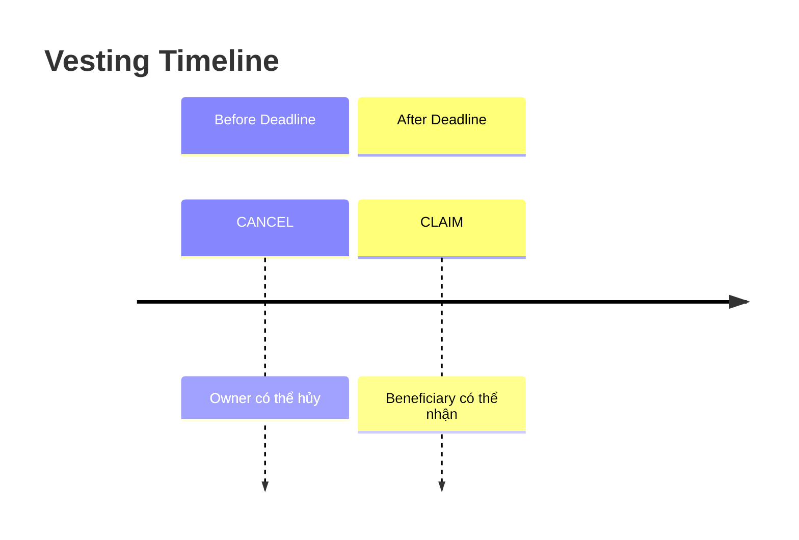
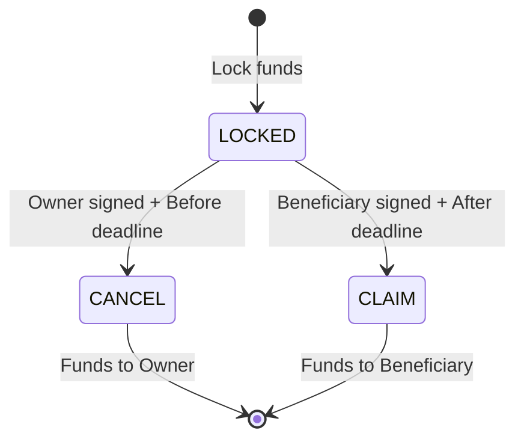

# Bài 01: Xây Dựng Spending Validator

:::info Mục tiêu
Viết validator (smart contract) đầu tiên để khóa tài sản và thiết lập điều kiện để mở khóa tài sản - Vesting Contract.
:::

---

## Mục Lục

1. [Tổng quan Spending Validator](#1-tổng-quan-spending-validator)
2. [Thiết kế Vesting Contract](#2-thiết-kế-vesting-contract)
3. [Implement Validator](#3-implement-validator)
4. [Viết Tests](#4-viết-tests)
5. [Build và Deploy](#5-build-và-deploy)
6. [Tương tác với Contract](#6-tương-tác-với-contract)
7. [Mở rộng và Cải tiến](#7-mở-rộng-và-cải-tiến)

---

## 1. Tổng Quan Spending Validator

### Spending Validator là gì?

Spending Validator là smart contract kiểm soát việc tiêu (spend) UTXOs trên Cardano.

| Thành phần | Mô tả |
|------------|-------|
| Lock funds | Gửi tiền đến SCRIPT ADDRESS |
| UTXO | Chứa Value, Address (script_hash), và Datum (conditions) |
| Validator | Kiểm tra Datum, Redeemer, Context và trả về True/False |

**Quy trình hoạt động:**

1. **Lock funds tại SCRIPT ADDRESS**: UTXO chứa giá trị (VD: 100 ADA), địa chỉ script_hash, và datum chứa các điều kiện
2. **Để SPEND, phải thỏa mãn VALIDATOR**: Validator kiểm tra Datum (stored state), Redeemer (action), Context (tx info) và trả về True hoặc False

**Use cases:**
- Vesting (time-locked funds)
- Escrow (multi-party agreements)
- DEX (token swaps)
- Lending (collateralized loans)
- NFT marketplaces

### Validator Signature

```aiken
// Spending validator trong Aiken có signature:

validator my_validator {
  spend(
    datum: Option<DatumType>,      // Data stored with UTXO
    redeemer: RedeemerType,        // Action provided in tx
    own_ref: OutputReference,      // Which UTXO being spent
    tx: Transaction,               // Full transaction context
  ) {
    // Validation logic
    // Return Bool (True = allow, False = reject)
  }
}
```

---

## 2. Thiết Kế Vesting Contract

### Vesting Contract là gì?

Vesting là việc khóa funds với điều kiện thời gian.

**Scenario:**
- Alice (Owner) locks 1000 ADA for Bob (Beneficiary)
- Deadline: January 1, 2025

**Rules:**
- TRƯỚC deadline: Alice có thể CANCEL
- SAU deadline: Bob có thể CLAIM



### Data Structures

```aiken
// ========== DATUM ==========
// Stored with UTXO, defines the vesting conditions

/// Vesting datum - lưu trữ thông tin vesting
type VestingDatum {
  /// Owner - người tạo vesting, có thể cancel
  owner: VerificationKeyHash,
  /// Beneficiary - người nhận, có thể claim sau deadline
  beneficiary: VerificationKeyHash,
  /// Deadline - thời điểm unlock (POSIX milliseconds)
  deadline: POSIXTime,
}

// ========== REDEEMER ==========
// Provided in transaction, specifies action

/// Vesting redeemer - action khi spend UTXO
type VestingRedeemer {
  /// Claim - beneficiary claims after deadline
  Claim
  /// Cancel - owner cancels before deadline
  Cancel
}

// ========== TYPE ALIASES ==========

/// Public key hash (28 bytes)
type VerificationKeyHash = ByteArray

/// POSIX timestamp in milliseconds
type POSIXTime = Int
```

### State Diagram



| State | Điều kiện | Kết quả |
|-------|-----------|---------|
| LOCKED | UTXO tồn tại | Chờ xử lý |
| CANCEL | Owner ký + Trước deadline | Funds về Owner |
| CLAIM | Beneficiary ký + Sau deadline | Funds về Beneficiary |
| SPENT | UTXO đã được tiêu | Kết thúc |

---

## 3. Implement Validator

### Project Structure

```
vesting/
├── aiken.toml
├── lib/
│   └── vesting/
│       ├── types.ak        # Data types
│       └── utils.ak        # Helper functions
├── validators/
│   └── vesting.ak          # Main validator
└── README.md
```

### aiken.toml

```toml
name = "vesting"
version = "0.1.0"
license = "Apache-2.0"
description = "A simple vesting contract"

[repository]
user = "your-github"
project = "vesting"
platform = "github"

[[dependencies]]
name = "aiken-lang/stdlib"
version = "v2.2.0"
source = "github"
```

### lib/vesting/types.ak

```aiken
/// Public key hash type (28 bytes)
pub type VerificationKeyHash =
  ByteArray

/// POSIX timestamp in milliseconds
pub type POSIXTime =
  Int

/// Vesting datum - stores vesting information
pub type VestingDatum {
  /// Owner who can cancel the vesting
  owner: VerificationKeyHash,
  /// Beneficiary who can claim after deadline
  beneficiary: VerificationKeyHash,
  /// Unlock deadline (POSIX timestamp)
  deadline: POSIXTime,
}

/// Vesting redeemer - action to perform
pub type VestingRedeemer {
  /// Beneficiary claims the funds (after deadline)
  Claim
  /// Owner cancels the vesting (before deadline)
  Cancel
}
```

### lib/vesting/utils.ak

```aiken
use aiken/collection/list
use cardano/transaction.{Transaction, ValidityRange}
use aiken/interval.{Finite, Interval, IntervalBound}

/// Check if a public key hash is in the signatories list
pub fn must_be_signed_by(
  signatories: List<ByteArray>,
  key_hash: ByteArray,
) -> Bool {
  list.has(signatories, key_hash)
}

/// Check if current time is after the given deadline
pub fn is_after_deadline(validity_range: ValidityRange, deadline: Int) -> Bool {
  // Get the lower bound of validity range
  when validity_range.lower_bound.bound_type is {
    Finite(tx_earliest_time) -> tx_earliest_time > deadline
    _ -> False
  }
}

/// Check if current time is before or at the deadline
pub fn is_before_deadline(validity_range: ValidityRange, deadline: Int) -> Bool {
  // Get the upper bound of validity range
  when validity_range.upper_bound.bound_type is {
    Finite(tx_latest_time) -> tx_latest_time <= deadline
    _ -> False
  }
}

// ========== TESTS ==========

test must_be_signed_by_present() {
  let signatories = [#"aabbcc", #"ddeeff", #"112233"]
  must_be_signed_by(signatories, #"ddeeff")
}

test must_be_signed_by_absent() {
  let signatories = [#"aabbcc", #"ddeeff"]
  !must_be_signed_by(signatories, #"112233")
}
```

### validators/vesting.ak

```aiken
use aiken/collection/list
use cardano/transaction.{OutputReference, Transaction}
use vesting/types.{VestingDatum, VestingRedeemer, Claim, Cancel}
use vesting/utils.{must_be_signed_by, is_after_deadline, is_before_deadline}

/// Vesting validator
///
/// This validator locks funds that can be:
/// - Claimed by the beneficiary after the deadline
/// - Cancelled by the owner before the deadline
validator vesting {
  spend(
    datum: Option<VestingDatum>,
    redeemer: VestingRedeemer,
    _own_ref: OutputReference,
    tx: Transaction,
  ) {
    // Datum must exist
    expect Some(d) = datum

    // Get transaction info
    let signatories = tx.extra_signatories
    let validity_range = tx.validity_range

    // Validate based on action
    when redeemer is {
      Claim -> {
        // Beneficiary claims after deadline
        trace @"Processing Claim action"

        // Check 1: Beneficiary must sign
        let beneficiary_signed = must_be_signed_by(signatories, d.beneficiary)

        // Check 2: Must be after deadline
        let deadline_passed = is_after_deadline(validity_range, d.deadline)

        // Both conditions must be true
        if beneficiary_signed && deadline_passed {
          trace @"Claim: SUCCESS"
          True
        } else {
          if !beneficiary_signed {
            trace @"Claim FAILED: Beneficiary signature missing"
          }
          if !deadline_passed {
            trace @"Claim FAILED: Deadline not passed"
          }
          False
        }
      }

      Cancel -> {
        // Owner cancels before deadline
        trace @"Processing Cancel action"

        // Check 1: Owner must sign
        let owner_signed = must_be_signed_by(signatories, d.owner)

        // Check 2: Must be before or at deadline
        let before_deadline = is_before_deadline(validity_range, d.deadline)

        // Both conditions must be true
        if owner_signed && before_deadline {
          trace @"Cancel: SUCCESS"
          True
        } else {
          if !owner_signed {
            trace @"Cancel FAILED: Owner signature missing"
          }
          if !before_deadline {
            trace @"Cancel FAILED: Deadline already passed"
          }
          False
        }
      }
    }
  }
}
```

---

## 4. Viết Tests

### Comprehensive Tests

```aiken
// Thêm vào cuối file validators/vesting.ak

use aiken/interval.{Finite, Interval, IntervalBound, PositiveInfinity, NegativeInfinity}
use cardano/assets
use cardano/address.{Address, Script, VerificationKey}

// ========== TEST FIXTURES ==========

const owner_pkh: ByteArray = #"00000000000000000000000000000000000000000000000000000001"
const beneficiary_pkh: ByteArray = #"00000000000000000000000000000000000000000000000000000002"
const random_pkh: ByteArray = #"00000000000000000000000000000000000000000000000000000003"
const deadline: Int = 1704067200000  // January 1, 2024 00:00:00 UTC

fn test_datum() -> VestingDatum {
  VestingDatum {
    owner: owner_pkh,
    beneficiary: beneficiary_pkh,
    deadline: deadline,
  }
}

fn mock_output_reference() -> OutputReference {
  OutputReference {
    transaction_id: #"0000000000000000000000000000000000000000000000000000000000000000",
    output_index: 0,
  }
}

fn mock_transaction(
  signatories: List<ByteArray>,
  lower_bound: Int,
  upper_bound: Int,
) -> Transaction {
  Transaction {
    inputs: [],
    reference_inputs: [],
    outputs: [],
    fee: 0,
    mint: assets.zero,
    certificates: [],
    withdrawals: [],
    validity_range: Interval {
      lower_bound: IntervalBound {
        bound_type: Finite(lower_bound),
        is_inclusive: True,
      },
      upper_bound: IntervalBound {
        bound_type: Finite(upper_bound),
        is_inclusive: True,
      },
    },
    extra_signatories: signatories,
    redeemers: [],
    datums: [],
    id: #"0000000000000000000000000000000000000000000000000000000000000000",
    votes: [],
    proposal_procedures: [],
    current_treasury_amount: None,
    treasury_donation: None,
  }
}

// ========== CLAIM TESTS ==========

test claim_succeeds_after_deadline_with_beneficiary_signature() {
  let datum = Some(test_datum())
  let redeemer = Claim
  let own_ref = mock_output_reference()

  // Time after deadline, beneficiary signs
  let tx = mock_transaction(
    [beneficiary_pkh],
    deadline + 1000,  // After deadline
    deadline + 2000,
  )

  vesting.spend(datum, redeemer, own_ref, tx)
}

test claim_fails_before_deadline() {
  let datum = Some(test_datum())
  let redeemer = Claim
  let own_ref = mock_output_reference()

  // Time before deadline
  let tx = mock_transaction(
    [beneficiary_pkh],
    deadline - 2000,  // Before deadline
    deadline - 1000,
  )

  !vesting.spend(datum, redeemer, own_ref, tx)
}

test claim_fails_without_beneficiary_signature() {
  let datum = Some(test_datum())
  let redeemer = Claim
  let own_ref = mock_output_reference()

  // After deadline, but wrong signer
  let tx = mock_transaction(
    [owner_pkh],  // Owner signed, not beneficiary
    deadline + 1000,
    deadline + 2000,
  )

  !vesting.spend(datum, redeemer, own_ref, tx)
}

test claim_fails_with_random_signature() {
  let datum = Some(test_datum())
  let redeemer = Claim
  let own_ref = mock_output_reference()

  // After deadline, random signer
  let tx = mock_transaction(
    [random_pkh],
    deadline + 1000,
    deadline + 2000,
  )

  !vesting.spend(datum, redeemer, own_ref, tx)
}

test claim_fails_at_exact_deadline() {
  let datum = Some(test_datum())
  let redeemer = Claim
  let own_ref = mock_output_reference()

  // Exactly at deadline (not after)
  let tx = mock_transaction(
    [beneficiary_pkh],
    deadline,
    deadline,
  )

  !vesting.spend(datum, redeemer, own_ref, tx)
}

// ========== CANCEL TESTS ==========

test cancel_succeeds_before_deadline_with_owner_signature() {
  let datum = Some(test_datum())
  let redeemer = Cancel
  let own_ref = mock_output_reference()

  // Time before deadline, owner signs
  let tx = mock_transaction(
    [owner_pkh],
    deadline - 2000,  // Before deadline
    deadline - 1000,
  )

  vesting.spend(datum, redeemer, own_ref, tx)
}

test cancel_succeeds_at_exact_deadline() {
  let datum = Some(test_datum())
  let redeemer = Cancel
  let own_ref = mock_output_reference()

  // Exactly at deadline (still allowed)
  let tx = mock_transaction(
    [owner_pkh],
    deadline - 1000,
    deadline,  // Upper bound at deadline
  )

  vesting.spend(datum, redeemer, own_ref, tx)
}

test cancel_fails_after_deadline() {
  let datum = Some(test_datum())
  let redeemer = Cancel
  let own_ref = mock_output_reference()

  // Time after deadline
  let tx = mock_transaction(
    [owner_pkh],
    deadline + 1000,  // After deadline
    deadline + 2000,
  )

  !vesting.spend(datum, redeemer, own_ref, tx)
}

test cancel_fails_without_owner_signature() {
  let datum = Some(test_datum())
  let redeemer = Cancel
  let own_ref = mock_output_reference()

  // Before deadline, but wrong signer
  let tx = mock_transaction(
    [beneficiary_pkh],  // Beneficiary signed, not owner
    deadline - 2000,
    deadline - 1000,
  )

  !vesting.spend(datum, redeemer, own_ref, tx)
}

// ========== EDGE CASE TESTS ==========

test claim_with_multiple_signatories() {
  let datum = Some(test_datum())
  let redeemer = Claim
  let own_ref = mock_output_reference()

  // Multiple signatures including beneficiary
  let tx = mock_transaction(
    [random_pkh, beneficiary_pkh, owner_pkh],
    deadline + 1000,
    deadline + 2000,
  )

  vesting.spend(datum, redeemer, own_ref, tx)
}

test cancel_with_multiple_signatories() {
  let datum = Some(test_datum())
  let redeemer = Cancel
  let own_ref = mock_output_reference()

  // Multiple signatures including owner
  let tx = mock_transaction(
    [random_pkh, owner_pkh, beneficiary_pkh],
    deadline - 2000,
    deadline - 1000,
  )

  vesting.spend(datum, redeemer, own_ref, tx)
}

test no_datum_fails() fail {
  let datum: Option<VestingDatum> = None
  let redeemer = Claim
  let own_ref = mock_output_reference()

  let tx = mock_transaction(
    [beneficiary_pkh],
    deadline + 1000,
    deadline + 2000,
  )

  // Should crash because expect Some(d) = datum will fail
  vesting.spend(datum, redeemer, own_ref, tx)
}
```

### Chạy Tests

```bash
# Chạy tất cả tests
aiken check

# Output expected:
#    Compiling vesting 0.1.0
#     Checking vesting 0.1.0
#       Testing ...
#
#    ┍━ vesting/utils ━━━━━━━━━━━━━━━━━━━━━━━━━
#    │ PASS [mem: ..., cpu: ...] must_be_signed_by_present
#    │ PASS [mem: ..., cpu: ...] must_be_signed_by_absent
#    ┕━━━━━━━━━━━━━━━━━━━━━━━━━━━━━━ 2 tests | 2 passed | 0 failed
#
#    ┍━ vesting ━━━━━━━━━━━━━━━━━━━━━━━━━━━━━━
#    │ PASS [mem: ..., cpu: ...] claim_succeeds_after_deadline...
#    │ PASS [mem: ..., cpu: ...] claim_fails_before_deadline
#    │ ... (more tests)
#    ┕━━━━━━━━━━━━━━━━━━━━━━━━━━━━━━ 12 tests | 12 passed | 0 failed

# Chạy với verbose traces
aiken check --trace-level verbose

# Chạy specific test
aiken check -m "claim_succeeds"
```

---

## 5. Build và Deploy

### Build Contract

```bash
# Build the validator
aiken build

# Output files created in:
# plutus.json - Contains compiled validators
```

### plutus.json Structure

```json
{
  "preamble": {
    "title": "vesting",
    "version": "0.1.0",
    "plutusVersion": "v3",
    "compiler": {
      "name": "Aiken",
      "version": "v1.1.0"
    }
  },
  "validators": [
    {
      "title": "vesting.vesting.spend",
      "datum": {
        "title": "datum",
        "schema": {
          "$ref": "#/definitions/vesting~1types~1VestingDatum"
        }
      },
      "redeemer": {
        "title": "redeemer",
        "schema": {
          "$ref": "#/definitions/vesting~1types~1VestingRedeemer"
        }
      },
      "compiledCode": "590a3f010000...",
      "hash": "abc123..."
    }
  ],
  "definitions": {
    "vesting/types/VestingDatum": {
      "dataType": "constructor",
      "fields": [
        { "title": "owner", "dataType": "bytes" },
        { "title": "beneficiary", "dataType": "bytes" },
        { "title": "deadline", "dataType": "integer" }
      ]
    },
    "vesting/types/VestingRedeemer": {
      "oneOf": [
        { "dataType": "constructor", "index": 0, "title": "Claim" },
        { "dataType": "constructor", "index": 1, "title": "Cancel" }
      ]
    }
  }
}
```

### Generate Script Address

```bash
# Using cardano-cli (if installed)
cardano-cli address build \
  --payment-script-file vesting.plutus \
  --testnet-magic 2 \
  --out-file vesting.addr

# Or using Mesh.js / Lucid in JavaScript
```

### Deploy to Testnet

```typescript
// Using Mesh.js (TypeScript example)

import { MeshWallet, Transaction, BlockfrostProvider } from "@meshsdk/core";
import blueprint from "./plutus.json";

// Setup provider
const provider = new BlockfrostProvider("YOUR_BLOCKFROST_KEY");

// Setup wallet
const wallet = new MeshWallet({
  networkId: 0, // Testnet
  fetcher: provider,
  submitter: provider,
  key: {
    type: "mnemonic",
    words: ["your", "mnemonic", "..."],
  },
});

// Get validator from blueprint
const validator = {
  code: blueprint.validators[0].compiledCode,
  version: "V3",
};

// Calculate script address
const scriptAddress = // ... derive from validator hash

// Create datum
const datum = {
  owner: "OWNER_PKH_HEX",
  beneficiary: "BENEFICIARY_PKH_HEX",
  deadline: 1704067200000, // POSIX time
};

// Build lock transaction
const tx = new Transaction({ initiator: wallet })
  .sendLovelace(
    {
      address: scriptAddress,
      datum: { value: datum, inline: true },
    },
    "10000000" // 10 ADA
  );

// Sign and submit
const unsignedTx = await tx.build();
const signedTx = await wallet.signTx(unsignedTx);
const txHash = await wallet.submitTx(signedTx);

console.log("Lock tx submitted:", txHash);
```

---

## 6. Tương Tác với Contract

### Claim (Beneficiary)

```typescript
// Beneficiary claims after deadline

import { MeshWallet, Transaction, BlockfrostProvider } from "@meshsdk/core";

// ... setup code ...

// Find the locked UTXO
const utxos = await provider.fetchAddressUTxOs(scriptAddress);
const lockedUtxo = utxos[0]; // The UTXO we want to claim

// Build claim transaction
const tx = new Transaction({ initiator: beneficiaryWallet })
  .redeemValue({
    value: lockedUtxo,
    script: validator,
    redeemer: {
      data: { constructor: 0, fields: [] }, // Claim = constructor 0
    },
  })
  .setRequiredSigners([beneficiaryPkh])
  .setTimeToStart(deadline + 1) // Must be after deadline
  .sendValue(beneficiaryAddress, lockedUtxo); // Send to self

const unsignedTx = await tx.build();
const signedTx = await beneficiaryWallet.signTx(unsignedTx);
const txHash = await beneficiaryWallet.submitTx(signedTx);

console.log("Claim tx:", txHash);
```

### Cancel (Owner)

```typescript
// Owner cancels before deadline

// Build cancel transaction
const tx = new Transaction({ initiator: ownerWallet })
  .redeemValue({
    value: lockedUtxo,
    script: validator,
    redeemer: {
      data: { constructor: 1, fields: [] }, // Cancel = constructor 1
    },
  })
  .setRequiredSigners([ownerPkh])
  .setTimeToExpire(deadline) // Must be before deadline
  .sendValue(ownerAddress, lockedUtxo); // Return to owner

const unsignedTx = await tx.build();
const signedTx = await ownerWallet.signTx(unsignedTx);
const txHash = await ownerWallet.submitTx(signedTx);

console.log("Cancel tx:", txHash);
```

---

## 7. Mở Rộng và Cải Tiến

### Version 2: Partial Vesting

```aiken
/// Enhanced vesting with partial claims

type VestingDatumV2 {
  owner: ByteArray,
  beneficiary: ByteArray,
  total_amount: Int,
  claimed_amount: Int,
  start_time: Int,
  end_time: Int,
}

type VestingRedeemerV2 {
  /// Claim available amount
  Claim { amount: Int }
  /// Cancel and return remaining
  Cancel
}

validator vesting_v2 {
  spend(
    datum: Option<VestingDatumV2>,
    redeemer: VestingRedeemerV2,
    own_ref: OutputReference,
    tx: Transaction,
  ) {
    expect Some(d) = datum

    when redeemer is {
      Claim { amount } -> {
        // Calculate vested amount based on time
        let current_time = get_current_time(tx)
        let vested = calculate_vested(d, current_time)
        let claimable = vested - d.claimed_amount

        // Checks
        let beneficiary_signed = has_signature(tx, d.beneficiary)
        let amount_valid = amount <= claimable && amount > 0

        // If partial claim, check continuing output
        let remaining = d.total_amount - d.claimed_amount - amount
        let continuing_valid = if remaining > 0 {
          check_continuing_output(tx, d, amount)
        } else {
          True
        }

        beneficiary_signed && amount_valid && continuing_valid
      }

      Cancel -> {
        // Owner can cancel before start_time
        let owner_signed = has_signature(tx, d.owner)
        let current_time = get_current_time(tx)
        let before_start = current_time < d.start_time

        owner_signed && before_start
      }
    }
  }
}

fn calculate_vested(d: VestingDatumV2, current_time: Int) -> Int {
  if current_time >= d.end_time {
    d.total_amount
  } else if current_time <= d.start_time {
    0
  } else {
    let elapsed = current_time - d.start_time
    let duration = d.end_time - d.start_time
    d.total_amount * elapsed / duration
  }
}
```

### Version 3: Multi-Beneficiary

```aiken
/// Vesting to multiple beneficiaries

type MultiBeneficiary {
  address: ByteArray,
  share: Int,  // Percentage (e.g., 50 for 50%)
}

type MultiVestingDatum {
  owner: ByteArray,
  beneficiaries: List<MultiBeneficiary>,
  deadline: Int,
  total_shares: Int,  // Should equal 100
}

validator multi_vesting {
  spend(
    datum: Option<MultiVestingDatum>,
    redeemer: VestingRedeemer,
    _own_ref: OutputReference,
    tx: Transaction,
  ) {
    expect Some(d) = datum

    when redeemer is {
      Claim -> {
        // Any beneficiary can trigger claim
        // But outputs must distribute according to shares
        let after_deadline = is_after_deadline(tx.validity_range, d.deadline)
        let correct_distribution = check_distribution(tx.outputs, d)

        after_deadline && correct_distribution
      }

      Cancel -> {
        // Only owner can cancel
        let owner_signed = has_signature(tx, d.owner)
        let before_deadline = is_before_deadline(tx.validity_range, d.deadline)

        owner_signed && before_deadline
      }
    }
  }
}
```

---

## Tài Liệu Tham Khảo

- [Aiken Validators](https://aiken-lang.org/language-tour/validators)
- [Cardano Spending Scripts](https://docs.cardano.org/plutus/spending-scripts)
- [Mesh.js Documentation](https://meshjs.dev/)
- [Lucid Documentation](https://lucid.spacebudz.io/)

---

**Phần tiếp theo:** [Part 04: Phát Hành Token & NFT](../04-minting-tokens-nfts/01_ft_vs_nft.md)
