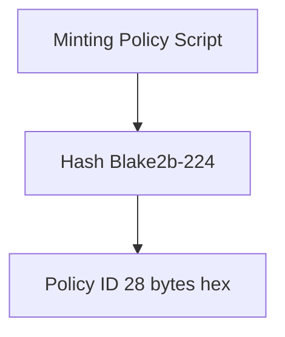
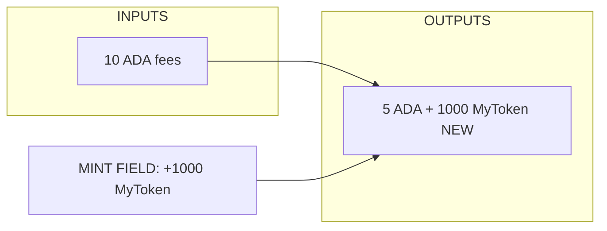
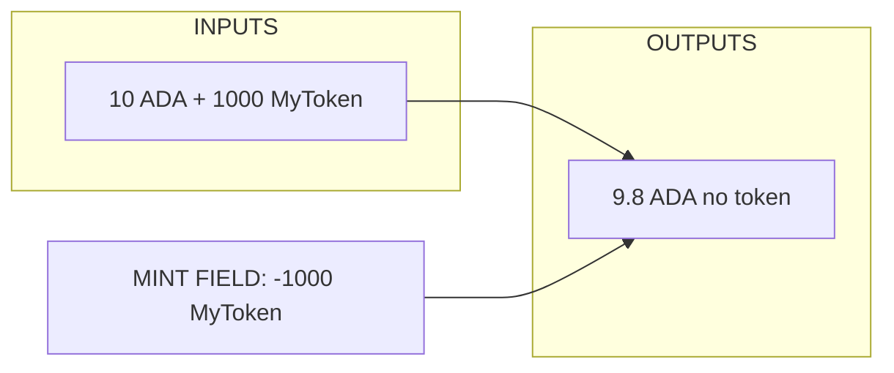
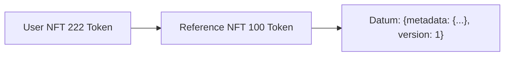

# Bài 01: Khái Niệm FT & NFT

:::info Mục tiêu
Hiểu về Fungible Tokens (FT) và Non-Fungible Tokens (NFT) trên Cardano, cách chúng hoạt động với Native Assets và Minting Policies.
:::

---

## Mục Lục

1. [Tổng quan Native Assets](#1-tổng-quan-native-assets)
2. [Fungible Tokens (FT)](#2-fungible-tokens-ft)
3. [Non-Fungible Tokens (NFT)](#3-non-fungible-tokens-nft)
4. [Policy ID và Asset Name](#4-policy-id-và-asset-name)
5. [Minting vs Burning](#5-minting-vs-burning)
6. [Token Metadata](#6-token-metadata)
7. [Use Cases](#7-use-cases)

---

## 1. Tổng Quan Native Assets

### Native Assets là gì?

Cardano Native Assets là các tokens được xử lý native bởi ledger, không cần smart contract để transfer.

| Tính năng | Ethereum | Cardano |
|-----------|----------|---------|
| Token Standard | ERC-20 Contract | Native Asset |
| Implementation | Smart contract | Ledger native |
| Gas/Fees | Gas intensive | Minimal fees |
| Complexity | Complex to create | Simple minting |
| Security | Reentrancy risks | No such risks |
| NFT Standard | ERC-721 | Native NFT |
| Metadata | On-chain (costly) | Flexible |

**Key Benefits:**
- Không cần smart contract cho transfers
- Bảo mật như ADA
- Phí thấp hơn
- Dễ làm việc hơn
- Multi-asset UTXOs

### Multi-Asset UTXO

Một UTXO có thể chứa NHIỀU loại assets:

```
UTXO
├── Address: addr1qxy...
└── Value:
    ├── ADA: 10,000,000 lovelace (10 ADA)
    ├── Policy_ABC:
    │   ├── "TokenA": 1000
    │   └── "TokenB": 500
    └── Policy_XYZ:
        └── "MyNFT": 1
```

:::warning Lưu ý
Mỗi UTXO cần minimum ADA để tồn tại (tùy thuộc vào số lượng assets và datum size).
:::

### Asset Identification

Mỗi asset được identify bởi:

| Thành phần | Mô tả | Ví dụ |
|------------|-------|-------|
| Policy ID | Hash của minting policy script (28 bytes) | "abc123def456..." |
| Asset Name | User-defined name (0-32 bytes) | "MyToken" hoặc "" |
| Asset ID | PolicyID + AssetName | "abc123def456.MyToken" |

**Trường hợp đặc biệt - ADA:**
- Policy ID: "" (empty)
- Asset Name: "" (empty)
- Là asset duy nhất có empty policy

---

## 2. Fungible Tokens (FT)

### FT là gì?

Fungible = Có thể thay thế lẫn nhau.

**Ví dụ thực tế:**
- 1 đồng $100 = 1 đồng $100 khác
- 1 gram vàng = 1 gram vàng khác
- 1 Bitcoin = 1 Bitcoin khác

**Đặc điểm:**

| Thuộc tính | Mô tả |
|------------|-------|
| Divisible | Chia nhỏ được |
| Interchangeable | Thay thế được |
| Same value per unit | Mỗi đơn vị có giá trị như nhau |
| Multiple units exist | Tồn tại nhiều đơn vị |

**Use Cases trên Cardano:**
- Stablecoins (DJED, iUSD)
- Utility tokens (project tokens)
- Governance tokens (voting)
- Wrapped assets

### FT Minting Policy

```aiken
/// Simple FT minting policy
/// Anyone with the right key can mint/burn

type FTRedeemer {
  Mint
  Burn
}

validator ft_policy {
  mint(redeemer: FTRedeemer, policy_id: PolicyId, tx: Transaction) {
    // Get minting info
    let minted = assets.tokens(tx.mint, policy_id)

    when redeemer is {
      Mint -> {
        // Check authorized minter signed
        let authorized = list.has(tx.extra_signatories, minter_pkh)
        // Check positive amount
        let positive_mint = all_positive(minted)

        authorized && positive_mint
      }

      Burn -> {
        // Anyone holding tokens can burn
        let negative_mint = all_negative(minted)
        negative_mint
      }
    }
  }
}

fn all_positive(tokens: Dict<AssetName, Int>) -> Bool {
  dict.foldl(tokens, True, fn(_, amount, acc) {
    acc && amount > 0
  })
}

fn all_negative(tokens: Dict<AssetName, Int>) -> Bool {
  dict.foldl(tokens, True, fn(_, amount, acc) {
    acc && amount < 0
  })
}
```

---

## 3. Non-Fungible Tokens (NFT)

### NFT là gì?

Non-Fungible = Không thể thay thế.

**Ví dụ thực tế:**
- Bức tranh Mona Lisa (chỉ có 1)
- Căn nhà (mỗi căn unique)
- Vé máy bay (specific seat, flight)

**Đặc điểm:**

| Thuộc tính | Mô tả |
|------------|-------|
| Unique | Độc nhất |
| Indivisible | Không chia nhỏ được |
| Quantity = 1 | Chỉ có 1 unit |
| Verifiable ownership | Xác minh quyền sở hữu |

**Use Cases trên Cardano:**
- Digital art
- Gaming items
- Identity/credentials
- Real estate tokens
- Event tickets
- Domain names

### NFT Uniqueness

Làm sao đảm bảo NFT chỉ có 1?

**Method 1: One-Shot Minting Policy**

Policy yêu cầu consuming một SPECIFIC UTXO:

```
UTXO X#0 (unique) --consume--> Can mint NFT
```

Sau khi UTXO X#0 được spent:
- Không thể mint lại
- Policy "expired"
- NFT mãi mãi unique

**Method 2: Time-Limited Policy**

Policy chỉ valid cho đến deadline. (Ít an toàn hơn - có thể mint nhiều trước deadline)

**Method 3: Counter/Registry**

Smart contract tracks minted IDs:
```
Registry UTXO: { minted: [1, 2, 3, 4, 5] }
Mint #6: Check 6 not in list, add to list
```

### One-Shot NFT Policy

```aiken
use aiken/collection/list
use cardano/transaction.{Transaction, OutputReference, Input}
use cardano/assets.{PolicyId}

/// One-shot NFT minting policy
/// Can only mint once by consuming specific UTXO

validator nft_policy(utxo_ref: OutputReference) {
  mint(_redeemer: Data, policy_id: PolicyId, tx: Transaction) {
    // Check that the specific UTXO is being consumed
    let utxo_consumed = list.any(
      tx.inputs,
      fn(input) { input.output_reference == utxo_ref }
    )

    // Check that exactly 1 NFT is minted
    let minted = assets.tokens(tx.mint, policy_id)
    let mint_count = dict.foldl(minted, 0, fn(_, qty, acc) { acc + qty })
    let only_one = mint_count == 1

    // Both conditions must be true
    utxo_consumed && only_one
  }
}
```

---

## 4. Policy ID và Asset Name

### Policy ID Deep Dive

Policy ID = Hash của Minting Policy Script.



**Properties:**
- Deterministic: same script -> same policy ID
- Immutable: không thể thay đổi sau khi tạo
- Unique: different scripts -> different policy IDs

**Parameterized Policies:**

```aiken
validator my_policy(param1, param2) { ... }

// Different params -> Different Policy ID
// my_policy(A, B) -> PolicyID_1
// my_policy(A, C) -> PolicyID_2
// my_policy(X, Y) -> PolicyID_3
```

### Asset Name Conventions

Asset Name = User-defined identifier (0-32 bytes).

| Loại Token | Convention | Ví dụ |
|------------|------------|-------|
| FT | Single name per policy, human-readable | "DJED", "iUSD", "MILK" |
| FT | Empty name | "" (policy itself is the token) |
| NFT | Multiple unique names | "SpaceBudz0001", "ClayNation1234" |
| NFT | Hex reference | "000643b0..." (CIP-68 reference) |

**CIP-67/68 Standard (NFT naming):**

| Prefix | Loại |
|--------|------|
| (100) | Reference NFT |
| (222) | NFT |
| (333) | FT |
| (444) | Rich FT |

Ví dụ: `(222)SpaceBud0001`

---

## 5. Minting vs Burning

### Minting Process

Minting = Tạo mới tokens (positive mint value).



**Value Equation:**
```
inputs + mint = outputs + fee
10 ADA + 1000 Token = (5 ADA + 1000 Token) + ~0.2 ADA
```

### Burning Process

Burning = Hủy tokens (negative mint value).



**Value Equation:**
```
inputs + mint = outputs + fee
(10 ADA + 1000 Token) + (-1000 Token) = 9.8 ADA + 0.2 fee
```

:::warning Lưu ý
Tokens bị DESTROYED, không thể recover!
:::

### Mint Field in Aiken

```aiken
use cardano/assets.{PolicyId, AssetName, Value}
use cardano/transaction.{Transaction}

/// Check what's being minted in a transaction
fn check_minting(tx: Transaction, policy_id: PolicyId) {
  // Get all minted tokens under this policy
  let minted_tokens = assets.tokens(tx.mint, policy_id)

  // Check specific token
  let my_token_amount = when dict.get(minted_tokens, "MyToken") is {
    Some(amount) -> amount
    None -> 0
  }

  // Positive = minting, Negative = burning
  if my_token_amount > 0 {
    trace @"Minting tokens"
  } else if my_token_amount < 0 {
    trace @"Burning tokens"
  } else {
    trace @"No mint/burn for this token"
  }
}

/// Ensure only specific amount is minted
fn validate_mint_amount(
  tx: Transaction,
  policy_id: PolicyId,
  asset_name: AssetName,
  expected: Int,
) -> Bool {
  let actual = assets.quantity_of(tx.mint, policy_id, asset_name)
  actual == expected
}
```

---

## 6. Token Metadata

### Metadata Standards

**CIP-25: NFT Metadata Standard (v1)**

Transaction Metadata (label 721):

```json
{
  "721": {
    "<policy_id>": {
      "<asset_name>": {
        "name": "SpaceBud #1234",
        "image": "ipfs://Qm...",
        "description": "A SpaceBud",
        "attributes": [
          { "trait": "Background", "value": "Red" }
        ]
      }
    }
  }
}
```

**CIP-68: NFT Metadata Standard (v2 - on-chain)**

Reference NFT stores metadata on-chain:



:::tip Lợi ích
CIP-68 cho phép updateable metadata!
:::

### FT Token Registry

GitHub: `cardano-foundation/cardano-token-registry`

JSON Entry:
```json
{
  "subject": "<policy_id><asset_name>",
  "name": {
    "value": "MyToken",
    "signatures": [...]
  },
  "description": {
    "value": "My awesome token",
    "signatures": [...]
  },
  "ticker": {
    "value": "MYT",
    "signatures": [...]
  },
  "decimals": {
    "value": 6,
    "signatures": [...]
  },
  "logo": {
    "value": "<base64_png>",
    "signatures": [...]
  }
}
```

---

## 7. Use Cases

### Common Applications

**FUNGIBLE TOKENS (FT):**

| Loại | Ví dụ |
|------|-------|
| Stablecoins | DJED (algorithmic), iUSD (over-collateralized), USDM (fiat-backed) |
| Utility tokens | In-game currencies, Platform credits, Access tokens |
| Governance tokens | DAO voting power, Protocol governance |
| Wrapped assets | Wrapped BTC, Wrapped ETH |

**NON-FUNGIBLE TOKENS (NFT):**

| Loại | Ví dụ |
|------|-------|
| Digital art | Profile pictures (PFPs), Generative art, 1/1 pieces |
| Gaming | In-game items, Characters/avatars, Land/property |
| Tickets & Access | Event tickets, Membership cards, VIP access |
| Credentials | Certificates, Diplomas, Licenses |
| Real World Assets (RWA) | Real estate fractions, Commodities, Securities |

---

## Tài Liệu Tham Khảo

- [CIP-25: NFT Metadata Standard](https://cips.cardano.org/cip/CIP-25)
- [CIP-68: Datum Metadata Standard](https://cips.cardano.org/cip/CIP-68)
- [Cardano Token Registry](https://github.com/cardano-foundation/cardano-token-registry)
- [Native Tokens Documentation](https://docs.cardano.org/native-tokens/learn)

---

**Bài tiếp theo:** [02. Minting Policies](./02_mint_tokens_nfts.md)
