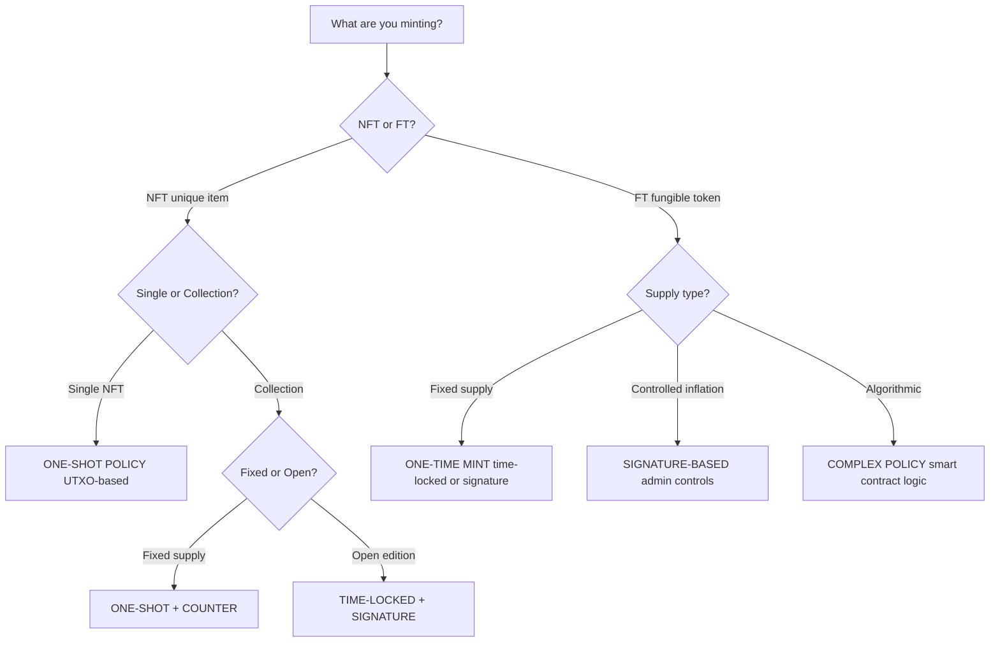

# Bài 02: Minting Policies

:::info Mục tiêu
Xây dựng Minting Policies để phát hành tokens và NFTs trên Cardano - từ simple policies đến one-shot NFT minting.
:::

---

## Mục Lục

1. [Tổng quan Minting Policy](#1-tổng-quan-minting-policy)
2. [Simple Minting Policy](#2-simple-minting-policy)
3. [Time-Locked Policy](#3-time-locked-policy)
4. [One-Shot NFT Policy](#4-one-shot-nft-policy)
5. [Multi-Asset Policy](#5-multi-asset-policy)
6. [Deploy và Mint](#6-deploy-và-mint)
7. [Best Practices](#7-best-practices)

---

## 1. Tổng Quan Minting Policy

### Minting Policy là gì?

Minting Policy = Script kiểm soát việc tạo/hủy tokens.

**Quy trình hoạt động:**

Khi transaction có mint field khác 0:
1. For EACH policy_id in mint: Execute minting policy
2. Policy returns True/False
3. ALL policies must return True for transaction to be valid

**Validator Signature:**

```aiken
validator my_policy {
  mint(
    redeemer: RedeemerType,  // Action
    policy_id: PolicyId,      // Own policy ID
    tx: Transaction,          // Full tx context
  ) {
    // Return Bool
  }
}
```

### Policy Types

| Loại | Mô tả | Use case |
|------|-------|----------|
| ALWAYS TRUE | Anyone can mint anytime | Chỉ dùng cho testing |
| SIGNATURE-BASED | Require specific signature(s) | Common cho FTs |
| TIME-LOCKED | Can only mint before/after deadline | Limited-time mints, NFT drops |
| ONE-SHOT | Can only mint once, requires specific UTXO | Perfect cho NFTs |
| COMPLEX | Combine multiple conditions | DAO-controlled, custom logic |

---

## 2. Simple Minting Policy

### Signature-Based Policy

```aiken
// lib/nft/types.ak

/// Minting redeemer
pub type MintRedeemer {
  /// Mint new tokens
  Mint
  /// Burn existing tokens
  Burn
}
```

```aiken
// validators/simple_mint.ak

use aiken/collection/list
use cardano/transaction.{Transaction}
use cardano/assets.{PolicyId}
use nft/types.{MintRedeemer, Mint, Burn}

/// Simple signature-based minting policy
/// Only authorized minter can mint, anyone can burn

validator simple_policy(minter_pkh: ByteArray) {
  mint(redeemer: MintRedeemer, policy_id: PolicyId, tx: Transaction) {
    // Get minted amount for this policy
    let minted = assets.tokens(tx.mint, policy_id)

    when redeemer is {
      Mint -> {
        trace @"Minting tokens"

        // Check 1: Minter must sign
        let minter_signed = list.has(tx.extra_signatories, minter_pkh)

        // Check 2: Must mint positive amount
        let positive_mint = dict.foldl(
          minted,
          True,
          fn(_, amount, acc) { acc && amount > 0 }
        )

        if minter_signed && positive_mint {
          trace @"Mint: SUCCESS"
          True
        } else {
          if !minter_signed {
            trace @"Mint FAILED: Minter signature missing"
          }
          if !positive_mint {
            trace @"Mint FAILED: Amount must be positive"
          }
          False
        }
      }

      Burn -> {
        trace @"Burning tokens"

        // Anyone can burn (negative amount)
        let negative_mint = dict.foldl(
          minted,
          True,
          fn(_, amount, acc) { acc && amount < 0 }
        )

        if negative_mint {
          trace @"Burn: SUCCESS"
          True
        } else {
          trace @"Burn FAILED: Amount must be negative"
          False
        }
      }
    }
  }
}

// ========== TESTS ==========

use aiken/interval.{Finite, Interval, IntervalBound}
use cardano/assets

const minter_pkh: ByteArray = #"00000000000000000000000000000000000000000000000000000001"
const other_pkh: ByteArray = #"00000000000000000000000000000000000000000000000000000002"
const test_policy_id: ByteArray = #"00000000000000000000000000000000000000000000000000000003"

fn mock_transaction(
  signatories: List<ByteArray>,
  mint_amount: Int,
) -> Transaction {
  Transaction {
    inputs: [],
    reference_inputs: [],
    outputs: [],
    fee: 0,
    mint: if mint_amount != 0 {
      assets.from_asset(test_policy_id, "TestToken", mint_amount)
    } else {
      assets.zero
    },
    certificates: [],
    withdrawals: [],
    validity_range: Interval {
      lower_bound: IntervalBound { bound_type: Finite(0), is_inclusive: True },
      upper_bound: IntervalBound { bound_type: Finite(100), is_inclusive: True },
    },
    extra_signatories: signatories,
    redeemers: [],
    datums: [],
    id: #"0000000000000000000000000000000000000000000000000000000000000000",
    votes: [],
    proposal_procedures: [],
    current_treasury_amount: None,
    treasury_donation: None,
  }
}

test mint_with_minter_signature() {
  let tx = mock_transaction([minter_pkh], 100)
  simple_policy.mint(minter_pkh, Mint, test_policy_id, tx)
}

test mint_fails_without_minter_signature() {
  let tx = mock_transaction([other_pkh], 100)
  !simple_policy.mint(minter_pkh, Mint, test_policy_id, tx)
}

test mint_fails_with_negative_amount() {
  let tx = mock_transaction([minter_pkh], -100)
  !simple_policy.mint(minter_pkh, Mint, test_policy_id, tx)
}

test burn_succeeds_with_negative_amount() {
  let tx = mock_transaction([other_pkh], -100)
  simple_policy.mint(minter_pkh, Burn, test_policy_id, tx)
}

test burn_fails_with_positive_amount() {
  let tx = mock_transaction([other_pkh], 100)
  !simple_policy.mint(minter_pkh, Burn, test_policy_id, tx)
}
```

---

## 3. Time-Locked Policy

### Deadline-Based Policy

```aiken
// validators/time_locked_mint.ak

use aiken/collection/list
use aiken/interval.{Finite}
use cardano/transaction.{Transaction}
use cardano/assets.{PolicyId}

/// Time-locked minting policy
/// Can only mint before deadline, anyone can burn anytime

validator time_locked_policy(minter_pkh: ByteArray, deadline: Int) {
  mint(redeemer: MintRedeemer, policy_id: PolicyId, tx: Transaction) {
    let minted = assets.tokens(tx.mint, policy_id)

    when redeemer is {
      Mint -> {
        trace @"Attempting time-locked mint"

        // Check 1: Minter must sign
        let minter_signed = list.has(tx.extra_signatories, minter_pkh)

        // Check 2: Must be before deadline
        let before_deadline = is_before_deadline(tx, deadline)

        // Check 3: Positive amount
        let positive = all_positive(minted)

        and {
          minter_signed?,
          before_deadline?,
          positive?,
        }
      }

      Burn -> {
        // Burning always allowed
        all_negative(minted)
      }
    }
  }
}

fn is_before_deadline(tx: Transaction, deadline: Int) -> Bool {
  when tx.validity_range.upper_bound.bound_type is {
    Finite(upper) -> upper <= deadline
    _ -> False
  }
}

fn all_positive(tokens: Dict<ByteArray, Int>) -> Bool {
  dict.foldl(tokens, True, fn(_, amount, acc) { acc && amount > 0 })
}

fn all_negative(tokens: Dict<ByteArray, Int>) -> Bool {
  dict.foldl(tokens, True, fn(_, amount, acc) { acc && amount < 0 })
}

// ========== TESTS ==========

const deadline: Int = 1704067200000  // Jan 1, 2024

fn mock_tx_with_time(
  signatories: List<ByteArray>,
  mint_amount: Int,
  tx_upper_bound: Int,
) -> Transaction {
  Transaction {
    inputs: [],
    reference_inputs: [],
    outputs: [],
    fee: 0,
    mint: assets.from_asset(test_policy_id, "Token", mint_amount),
    certificates: [],
    withdrawals: [],
    validity_range: Interval {
      lower_bound: IntervalBound { bound_type: Finite(0), is_inclusive: True },
      upper_bound: IntervalBound { bound_type: Finite(tx_upper_bound), is_inclusive: True },
    },
    extra_signatories: signatories,
    redeemers: [],
    datums: [],
    id: #"0000000000000000000000000000000000000000000000000000000000000000",
    votes: [],
    proposal_procedures: [],
    current_treasury_amount: None,
    treasury_donation: None,
  }
}

test time_locked_mint_before_deadline() {
  let tx = mock_tx_with_time([minter_pkh], 100, deadline - 1000)
  time_locked_policy.mint(minter_pkh, deadline, Mint, test_policy_id, tx)
}

test time_locked_mint_fails_after_deadline() {
  let tx = mock_tx_with_time([minter_pkh], 100, deadline + 1000)
  !time_locked_policy.mint(minter_pkh, deadline, Mint, test_policy_id, tx)
}

test time_locked_burn_after_deadline() {
  // Burn should work even after deadline
  let tx = mock_tx_with_time([other_pkh], -100, deadline + 1000)
  time_locked_policy.mint(minter_pkh, deadline, Burn, test_policy_id, tx)
}
```

---

## 4. One-Shot NFT Policy

### Unique NFT Minting

```aiken
// validators/one_shot_nft.ak

use aiken/collection/list
use aiken/collection/dict
use cardano/transaction.{Transaction, OutputReference, Input}
use cardano/assets.{PolicyId, AssetName}

/// One-shot NFT minting policy
/// Can only mint ONCE by consuming a specific UTXO
/// Guarantees NFT uniqueness

validator one_shot_nft(utxo_ref: OutputReference) {
  mint(_redeemer: Data, policy_id: PolicyId, tx: Transaction) {
    trace @"One-shot NFT minting"

    // Check 1: The specific UTXO must be consumed
    let utxo_consumed = list.any(
      tx.inputs,
      fn(input) { input.output_reference == utxo_ref }
    )

    // Check 2: Get minted tokens under this policy
    let minted = assets.tokens(tx.mint, policy_id)

    // Check 3: Calculate total minted quantity
    let total_minted = dict.foldl(
      minted,
      0,
      fn(_name, amount, acc) { acc + amount }
    )

    // For minting: must be exactly 1 (or specific amount)
    // For burning: any negative amount is fine
    let valid_amount = if total_minted > 0 {
      // Minting: require specific UTXO
      utxo_consumed && total_minted == 1
    } else {
      // Burning: always allow
      True
    }

    if valid_amount {
      trace @"NFT mint/burn: SUCCESS"
      True
    } else {
      if !utxo_consumed {
        trace @"NFT mint FAILED: Required UTXO not consumed"
      }
      if total_minted != 1 && total_minted > 0 {
        trace @"NFT mint FAILED: Must mint exactly 1 NFT"
      }
      False
    }
  }
}

// ========== TESTS ==========

const required_utxo: OutputReference = OutputReference {
  transaction_id: #"1111111111111111111111111111111111111111111111111111111111111111",
  output_index: 0,
}

const other_utxo: OutputReference = OutputReference {
  transaction_id: #"2222222222222222222222222222222222222222222222222222222222222222",
  output_index: 0,
}

fn mock_input(ref: OutputReference) -> Input {
  Input {
    output_reference: ref,
    output: Output {
      address: mock_address(),
      value: assets.from_lovelace(5_000_000),
      datum: NoDatum,
      reference_script: None,
    },
  }
}

fn mock_nft_tx(
  inputs: List<Input>,
  mint_amount: Int,
  asset_name: ByteArray,
) -> Transaction {
  Transaction {
    inputs: inputs,
    reference_inputs: [],
    outputs: [],
    fee: 0,
    mint: assets.from_asset(test_policy_id, asset_name, mint_amount),
    certificates: [],
    withdrawals: [],
    validity_range: mock_validity_range(),
    extra_signatories: [],
    redeemers: [],
    datums: [],
    id: #"0000000000000000000000000000000000000000000000000000000000000000",
    votes: [],
    proposal_procedures: [],
    current_treasury_amount: None,
    treasury_donation: None,
  }
}

test one_shot_mint_with_required_utxo() {
  let inputs = [mock_input(required_utxo)]
  let tx = mock_nft_tx(inputs, 1, "MyNFT")
  one_shot_nft.mint(required_utxo, "", test_policy_id, tx)
}

test one_shot_mint_fails_without_required_utxo() {
  let inputs = [mock_input(other_utxo)]
  let tx = mock_nft_tx(inputs, 1, "MyNFT")
  !one_shot_nft.mint(required_utxo, "", test_policy_id, tx)
}

test one_shot_mint_fails_with_multiple_nfts() {
  let inputs = [mock_input(required_utxo)]
  let tx = mock_nft_tx(inputs, 2, "MyNFT")  // Trying to mint 2
  !one_shot_nft.mint(required_utxo, "", test_policy_id, tx)
}

test one_shot_burn_always_allowed() {
  let inputs = [mock_input(other_utxo)]
  let tx = mock_nft_tx(inputs, -1, "MyNFT")  // Burning
  one_shot_nft.mint(required_utxo, "", test_policy_id, tx)
}
```

### NFT Collection Policy

```aiken
// validators/nft_collection.ak

use aiken/collection/list
use aiken/collection/dict
use cardano/transaction.{Transaction, OutputReference}
use cardano/assets.{PolicyId}

/// NFT Collection minting policy
/// - Uses UTXO for uniqueness
/// - Validates asset name format
/// - Enforces max supply

type CollectionRedeemer {
  MintNFT { token_name: ByteArray }
  BurnNFT
}

validator nft_collection(
  utxo_ref: OutputReference,
  collection_name: ByteArray,
  max_supply: Int,
) {
  mint(redeemer: CollectionRedeemer, policy_id: PolicyId, tx: Transaction) {
    let minted = assets.tokens(tx.mint, policy_id)

    when redeemer is {
      MintNFT { token_name } -> {
        trace @"Minting NFT from collection"

        // Check 1: Required UTXO consumed (first mint only)
        // For subsequent mints, we'd need different logic (e.g., counter)
        let utxo_check = list.any(
          tx.inputs,
          fn(input) { input.output_reference == utxo_ref }
        )

        // Check 2: Token name starts with collection name
        let valid_name = starts_with(token_name, collection_name)

        // Check 3: Exactly 1 NFT minted
        let mint_count = dict.foldl(minted, 0, fn(_, qty, acc) { acc + qty })
        let single_mint = mint_count == 1

        // Check 4: Minted token has correct name
        let correct_token = when dict.get(minted, token_name) is {
          Some(qty) -> qty == 1
          None -> False
        }

        and {
          utxo_check?,
          valid_name?,
          single_mint?,
          correct_token?,
        }
      }

      BurnNFT -> {
        // All amounts must be negative (burning)
        dict.foldl(minted, True, fn(_, qty, acc) { acc && qty < 0 })
      }
    }
  }
}

fn starts_with(full: ByteArray, prefix: ByteArray) -> Bool {
  let prefix_len = builtin.length_of_bytearray(prefix)
  let full_prefix = builtin.slice_bytearray(0, prefix_len, full)
  full_prefix == prefix
}
```

---

## 5. Multi-Asset Policy

### Multiple Tokens per Policy

```aiken
// validators/multi_asset.ak

use aiken/collection/list
use aiken/collection/dict
use cardano/transaction.{Transaction}
use cardano/assets.{PolicyId, AssetName}

/// Multi-asset policy that can mint different token types
/// Each token type has different rules

type TokenType {
  /// Governance token - only admin can mint
  Governance
  /// Utility token - anyone with fee can mint
  Utility
  /// Reward token - only reward contract can mint
  Reward
}

type MultiAssetRedeemer {
  MintToken { token_type: TokenType, amount: Int }
  BurnToken
}

validator multi_asset_policy(
  admin_pkh: ByteArray,
  reward_script_hash: ByteArray,
) {
  mint(redeemer: MultiAssetRedeemer, policy_id: PolicyId, tx: Transaction) {
    when redeemer is {
      MintToken { token_type, amount } -> {
        expect amount > 0

        when token_type is {
          Governance -> {
            // Only admin can mint governance tokens
            trace @"Minting governance tokens"
            let admin_signed = list.has(tx.extra_signatories, admin_pkh)

            // Check correct token is minted
            let gov_minted = assets.quantity_of(tx.mint, policy_id, "GOV")

            admin_signed && gov_minted == amount
          }

          Utility -> {
            // Anyone can mint utility tokens
            trace @"Minting utility tokens"
            let util_minted = assets.quantity_of(tx.mint, policy_id, "UTIL")

            // Must pay fee (simplified - check output to treasury)
            let fee_paid = check_fee_paid(tx, amount)

            util_minted == amount && fee_paid
          }

          Reward -> {
            // Only reward contract can mint
            trace @"Minting reward tokens"
            let reward_minted = assets.quantity_of(tx.mint, policy_id, "REWARD")

            // Check reward contract is in inputs
            let reward_contract_present = list.any(
              tx.inputs,
              fn(input) {
                is_script_credential(input.output.address, reward_script_hash)
              }
            )

            reward_minted == amount && reward_contract_present
          }
        }
      }

      BurnToken -> {
        // Anyone holding tokens can burn
        let all_negative = dict.foldl(
          assets.tokens(tx.mint, policy_id),
          True,
          fn(_, qty, acc) { acc && qty < 0 }
        )
        all_negative
      }
    }
  }
}

fn check_fee_paid(tx: Transaction, amount: Int) -> Bool {
  // Simplified: check treasury receives fee
  let fee_per_token = 1_000_000  // 1 ADA per token
  let required_fee = amount * fee_per_token

  // Check output to treasury address contains required ADA
  // (Simplified implementation)
  True
}

fn is_script_credential(address: Address, script_hash: ByteArray) -> Bool {
  when address.payment_credential is {
    Script(hash) -> hash == script_hash
    _ -> False
  }
}
```

---

## 6. Deploy và Mint

### Build và Generate Blueprint

```bash
# Build the project
aiken build

# Check plutus.json for validator info
cat plutus.json | jq '.validators'
```

### Off-Chain: Mint NFT (TypeScript)

```typescript
// mint-nft.ts
import {
  MeshWallet,
  Transaction,
  BlockfrostProvider,
  resolveScriptHash,
  serializePlutusScript,
} from "@meshsdk/core";
import blueprint from "./plutus.json";

async function mintNFT() {
  // Setup
  const provider = new BlockfrostProvider("YOUR_API_KEY");
  const wallet = new MeshWallet({
    networkId: 0,
    fetcher: provider,
    submitter: provider,
    key: {
      type: "mnemonic",
      words: ["your", "seed", "phrase", "..."],
    },
  });

  // Get UTXOs
  const utxos = await wallet.getUtxos();
  const utxoToSpend = utxos[0]; // Use first UTXO for one-shot

  // Prepare the parameter (UTXO reference)
  const utxoRef = {
    txHash: utxoToSpend.input.txHash,
    outputIndex: utxoToSpend.input.outputIndex,
  };

  // Get validator from blueprint and apply parameter
  const validator = {
    code: applyParamsToScript(
      blueprint.validators[0].compiledCode,
      [utxoRef]
    ),
    version: "V3",
  };

  // Calculate policy ID
  const policyId = resolveScriptHash(
    serializePlutusScript(validator).code,
    "V3"
  );

  // NFT metadata (CIP-25)
  const metadata = {
    [policyId]: {
      MyNFT: {
        name: "My First NFT",
        image: "ipfs://QmXxx...",
        description: "My first NFT on Cardano!",
        attributes: [
          { trait_type: "Background", value: "Blue" },
          { trait_type: "Rarity", value: "Common" },
        ],
      },
    },
  };

  // Build transaction
  const tx = new Transaction({ initiator: wallet })
    // Spend the UTXO (required for one-shot)
    .spendUtxo(utxoToSpend)
    // Mint the NFT
    .mintAsset(validator, {
      assetName: "MyNFT",
      assetQuantity: "1",
      recipient: await wallet.getChangeAddress(),
      metadata: metadata,
      label: "721", // CIP-25 label
    });

  // Build, sign, submit
  const unsignedTx = await tx.build();
  const signedTx = await wallet.signTx(unsignedTx);
  const txHash = await wallet.submitTx(signedTx);

  console.log("NFT Minted!");
  console.log("Tx Hash:", txHash);
  console.log("Policy ID:", policyId);
  console.log("Asset:", `${policyId}.MyNFT`);
}

mintNFT();
```

### Off-Chain: Mint FT (TypeScript)

```typescript
// mint-ft.ts
async function mintFungibleToken() {
  // ... setup code ...

  // For signature-based policy, need minter's signature
  const minterPkh = "..."; // Minter's public key hash

  // Get validator with minter parameter
  const validator = {
    code: applyParamsToScript(
      blueprint.validators[0].compiledCode,
      [minterPkh]
    ),
    version: "V3",
  };

  const policyId = resolveScriptHash(
    serializePlutusScript(validator).code,
    "V3"
  );

  // Mint 1,000,000 tokens
  const tx = new Transaction({ initiator: wallet })
    .mintAsset(validator, {
      assetName: "MYTOKEN",
      assetQuantity: "1000000",
      recipient: await wallet.getChangeAddress(),
    })
    .setRequiredSigners([minterPkh]); // Minter must sign

  const unsignedTx = await tx.build();
  const signedTx = await wallet.signTx(unsignedTx);
  const txHash = await wallet.submitTx(signedTx);

  console.log("Tokens Minted!");
  console.log("Amount: 1,000,000 MYTOKEN");
}
```

### Off-Chain: Burn Tokens

```typescript
// burn-tokens.ts
async function burnTokens() {
  // ... setup code ...

  // Find UTXO with tokens to burn
  const utxos = await wallet.getUtxos();
  const tokenUtxo = utxos.find((u) =>
    u.output.amount.some((a) => a.unit.includes(policyId))
  );

  // Build burn transaction
  const tx = new Transaction({ initiator: wallet })
    .burnAsset(validator, {
      assetName: "MYTOKEN",
      assetQuantity: "-500000", // Negative = burn
    });

  const unsignedTx = await tx.build();
  const signedTx = await wallet.signTx(unsignedTx);
  const txHash = await wallet.submitTx(signedTx);

  console.log("Tokens Burned!");
  console.log("Tx Hash:", txHash);
}
```

---

## 7. Best Practices

### Do's và Don'ts

:::tip NÊN LÀM
- Use one-shot for NFTs (guarantees uniqueness)
- Validate all mint amounts (positive for mint, negative burn)
- Add time locks for limited mints
- Test all minting paths thoroughly
- Include proper metadata (CIP-25/68)
- Use parameterized policies for flexibility
- Document your policy's rules clearly
:::

:::warning KHÔNG NÊN LÀM
- Never use "always true" in production
- Don't forget to restrict minting (who can mint?)
- Don't allow unlimited minting without checks
- Don't ignore the burn case
- Don't deploy without testing on testnet
- Don't hardcode values that should be parameters
:::

### Policy Decision Tree



---

## Tài Liệu Tham Khảo

- [Aiken Minting Policies](https://aiken-lang.org/example--gift-card)
- [CIP-25: NFT Metadata](https://cips.cardano.org/cip/CIP-25)
- [Cardano Native Tokens](https://docs.cardano.org/native-tokens)
- [Mesh.js Minting Guide](https://meshjs.dev/guides/minting)

---

**Phần tiếp theo:** [Part 05: Hợp Đồng Escrow](../05-escrow-contract/01_build_escrow_contract.md)
