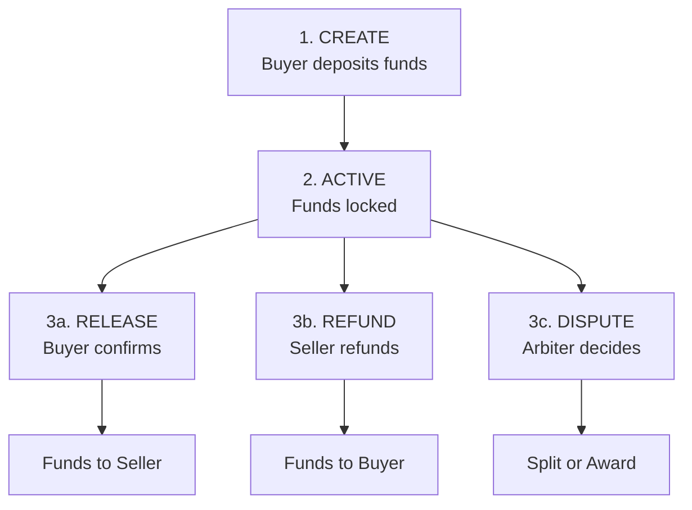
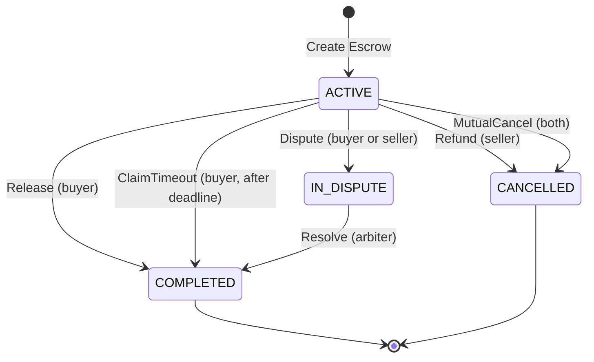

# Bài 01: Xây Dựng Hợp Đồng Ký Quỹ (Escrow Contract)

:::info Mục tiêu
Tạo môi trường giao dịch an toàn giữa buyer và seller với Escrow smart contract - một trong những use cases phổ biến nhất của smart contracts.
:::

---

## Mục Lục

1. [Tổng quan Escrow](#1-tổng-quan-escrow)
2. [Thiết kế Contract](#2-thiết-kế-contract)
3. [Implement Escrow Validator](#3-implement-escrow-validator)
4. [Viết Tests](#4-viết-tests)
5. [Advanced Features](#5-advanced-features)
6. [Deploy và Tương tác](#6-deploy-và-tương-tác)
7. [Security Considerations](#7-security-considerations)

---

## 1. Tổng Quan Escrow

### Escrow là gì?

Escrow = Bên thứ 3 giữ tiền cho đến khi điều kiện thỏa mãn.

**Traditional Escrow:**
```
BUYER --$--> ESCROW AGENT --$--> SELLER
                 |
                 | Holds until:
                 | - Goods delivered
                 | - Both parties agree
                 | - Dispute resolved
```

**Smart Contract Escrow:**
```
BUYER --ADA--> SMART CONTRACT --ADA--> SELLER
                    |
                    | Code enforces:
                    | - Release conditions
                    | - Refund conditions
                    | - Dispute resolution

NO TRUSTED THIRD PARTY NEEDED!
```

**Use Cases:**
- P2P trading (OTC)
- Freelance payments
- Real estate transactions
- Crowdfunding milestones
- NFT trading with escrow

### Escrow Flow



| Giai đoạn | Mô tả |
|-----------|-------|
| CREATE | Buyer deposits funds với datum: buyer, seller, amount, deadline |
| ACTIVE | Waiting for: Buyer release, Seller refund, Deadline pass, hoặc Dispute |
| RELEASE | Buyer satisfied, funds to seller |
| REFUND | Seller agrees to refund buyer |
| DISPUTE | Arbiter decides split or award |

---

## 2. Thiết Kế Contract

### Project Structure

```
escrow/
├── aiken.toml
├── lib/
│   └── escrow/
│       ├── types.ak        # Data types
│       └── utils.ak        # Helper functions
├── validators/
│   └── escrow.ak           # Main validator
└── README.md
```

### Data Structures

```aiken
// lib/escrow/types.ak

/// Public key hash type
pub type VerificationKeyHash = ByteArray

/// POSIX timestamp
pub type POSIXTime = Int

/// Escrow status
pub type EscrowStatus {
  /// Escrow is active, waiting for resolution
  Active
  /// Escrow completed (released to seller)
  Completed
  /// Escrow cancelled (refunded to buyer)
  Cancelled
  /// Escrow in dispute
  InDispute
}

/// Escrow datum - stored with locked funds
pub type EscrowDatum {
  /// Buyer who deposits funds
  buyer: VerificationKeyHash,
  /// Seller who receives funds on completion
  seller: VerificationKeyHash,
  /// Optional arbiter for disputes
  arbiter: Option<VerificationKeyHash>,
  /// Amount locked (in lovelace)
  amount: Int,
  /// Deadline for automatic refund
  deadline: POSIXTime,
  /// Current status
  status: EscrowStatus,
  /// Description/reference (hash)
  description_hash: ByteArray,
}

/// Escrow actions (redeemer)
pub type EscrowRedeemer {
  /// Buyer releases funds to seller (happy path)
  Release
  /// Seller agrees to refund buyer
  Refund
  /// Buyer claims refund after deadline
  ClaimTimeout
  /// Initiate dispute (buyer or seller)
  Dispute
  /// Arbiter resolves dispute
  Resolve { to_buyer_percent: Int }
  /// Both parties agree to cancel
  MutualCancel
}
```

### State Diagram



| Action | Ai thực hiện | Điều kiện | Kết quả |
|--------|--------------|-----------|---------|
| Release | Buyer | - | Funds to Seller |
| Refund | Seller | - | Funds to Buyer |
| ClaimTimeout | Buyer | After deadline | Funds to Buyer |
| Dispute | Buyer or Seller | Before deadline, has arbiter | Status = InDispute |
| Resolve | Arbiter | - | Split funds by percent |
| MutualCancel | Both | - | Funds to Buyer |

---

## 3. Implement Escrow Validator

### lib/escrow/types.ak

```aiken
/// Public key hash type
pub type VerificationKeyHash =
  ByteArray

/// POSIX timestamp
pub type POSIXTime =
  Int

/// Escrow datum
pub type EscrowDatum {
  buyer: VerificationKeyHash,
  seller: VerificationKeyHash,
  arbiter: Option<VerificationKeyHash>,
  amount: Int,
  deadline: POSIXTime,
}

/// Escrow redeemer
pub type EscrowRedeemer {
  /// Buyer releases funds to seller
  Release
  /// Seller refunds buyer
  Refund
  /// Buyer claims after deadline
  ClaimTimeout
  /// Either party disputes
  Dispute
  /// Arbiter resolves (percent to buyer: 0-100)
  Resolve { to_buyer_percent: Int }
  /// Mutual agreement to cancel
  MutualCancel
}
```

### lib/escrow/utils.ak

```aiken
use aiken/collection/list
use aiken/interval.{Finite}
use cardano/transaction.{Transaction}

/// Check if public key signed the transaction
pub fn signed_by(tx: Transaction, pkh: ByteArray) -> Bool {
  list.has(tx.extra_signatories, pkh)
}

/// Check if current time is after deadline
pub fn is_after_deadline(tx: Transaction, deadline: Int) -> Bool {
  when tx.validity_range.lower_bound.bound_type is {
    Finite(lower) -> lower > deadline
    _ -> False
  }
}

/// Check if current time is before deadline
pub fn is_before_deadline(tx: Transaction, deadline: Int) -> Bool {
  when tx.validity_range.upper_bound.bound_type is {
    Finite(upper) -> upper <= deadline
    _ -> False
  }
}

/// Validate percentage is valid (0-100)
pub fn valid_percent(percent: Int) -> Bool {
  percent >= 0 && percent <= 100
}

// ========== TESTS ==========

test valid_percent_0() {
  valid_percent(0)
}

test valid_percent_100() {
  valid_percent(100)
}

test valid_percent_50() {
  valid_percent(50)
}

test invalid_percent_negative() {
  !valid_percent(-1)
}

test invalid_percent_over_100() {
  !valid_percent(101)
}
```

### validators/escrow.ak

```aiken
use aiken/collection/list
use cardano/transaction.{Transaction, OutputReference, Output}
use cardano/address.{Address}
use cardano/assets
use escrow/types.{
  EscrowDatum, EscrowRedeemer,
  Release, Refund, ClaimTimeout, Dispute, Resolve, MutualCancel,
}
use escrow/utils.{signed_by, is_after_deadline, is_before_deadline, valid_percent}

/// Escrow Validator
///
/// Secure escrow between buyer and seller with optional arbiter
///
/// Actions:
/// - Release: Buyer confirms, funds go to seller
/// - Refund: Seller agrees to refund buyer
/// - ClaimTimeout: Buyer claims after deadline passes
/// - Dispute: Either party initiates dispute (requires arbiter)
/// - Resolve: Arbiter splits funds
/// - MutualCancel: Both agree to return funds to buyer
validator escrow {
  spend(
    datum: Option<EscrowDatum>,
    redeemer: EscrowRedeemer,
    own_ref: OutputReference,
    tx: Transaction,
  ) {
    // Datum must exist
    expect Some(d) = datum

    when redeemer is {
      // ========== RELEASE ==========
      // Buyer satisfied, releases funds to seller
      Release -> {
        trace @"Processing Release"

        // Only buyer can release
        let buyer_signed = signed_by(tx, d.buyer)

        // Verify seller receives the funds
        let seller_paid = check_payment_to(tx, d.seller, d.amount)

        if buyer_signed && seller_paid {
          trace @"Release: SUCCESS"
          True
        } else {
          if !buyer_signed {
            trace @"Release FAILED: Buyer must sign"
          }
          if !seller_paid {
            trace @"Release FAILED: Seller not paid correctly"
          }
          False
        }
      }

      // ========== REFUND ==========
      // Seller agrees to refund
      Refund -> {
        trace @"Processing Refund"

        // Only seller can initiate refund
        let seller_signed = signed_by(tx, d.seller)

        // Verify buyer receives refund
        let buyer_refunded = check_payment_to(tx, d.buyer, d.amount)

        if seller_signed && buyer_refunded {
          trace @"Refund: SUCCESS"
          True
        } else {
          if !seller_signed {
            trace @"Refund FAILED: Seller must sign"
          }
          if !buyer_refunded {
            trace @"Refund FAILED: Buyer not refunded correctly"
          }
          False
        }
      }

      // ========== CLAIM TIMEOUT ==========
      // Buyer claims after deadline (seller didn't deliver)
      ClaimTimeout -> {
        trace @"Processing ClaimTimeout"

        // Buyer must sign
        let buyer_signed = signed_by(tx, d.buyer)

        // Must be after deadline
        let after_deadline = is_after_deadline(tx, d.deadline)

        // Buyer receives funds
        let buyer_paid = check_payment_to(tx, d.buyer, d.amount)

        if buyer_signed && after_deadline && buyer_paid {
          trace @"ClaimTimeout: SUCCESS"
          True
        } else {
          if !buyer_signed {
            trace @"ClaimTimeout FAILED: Buyer must sign"
          }
          if !after_deadline {
            trace @"ClaimTimeout FAILED: Deadline not passed"
          }
          if !buyer_paid {
            trace @"ClaimTimeout FAILED: Buyer not paid"
          }
          False
        }
      }

      // ========== DISPUTE ==========
      // Either party initiates dispute (needs arbiter)
      Dispute -> {
        trace @"Processing Dispute"

        // Must have arbiter defined
        expect Some(_arbiter) = d.arbiter

        // Either buyer or seller must sign
        let valid_signer = signed_by(tx, d.buyer) || signed_by(tx, d.seller)

        // Must be before deadline
        let before_deadline = is_before_deadline(tx, d.deadline)

        // Must have continuing output with dispute status
        // (Simplified: in production, update datum to InDispute)

        if valid_signer && before_deadline {
          trace @"Dispute: SUCCESS"
          True
        } else {
          if !valid_signer {
            trace @"Dispute FAILED: Buyer or seller must sign"
          }
          if !before_deadline {
            trace @"Dispute FAILED: Must be before deadline"
          }
          False
        }
      }

      // ========== RESOLVE ==========
      // Arbiter resolves dispute
      Resolve { to_buyer_percent } -> {
        trace @"Processing Resolve"

        // Must have arbiter
        expect Some(arbiter) = d.arbiter

        // Arbiter must sign
        let arbiter_signed = signed_by(tx, arbiter)

        // Percent must be valid
        let percent_valid = valid_percent(to_buyer_percent)

        // Calculate split
        let to_buyer = d.amount * to_buyer_percent / 100
        let to_seller = d.amount - to_buyer

        // Verify payments
        let buyer_paid = if to_buyer > 0 {
          check_payment_to(tx, d.buyer, to_buyer)
        } else {
          True
        }

        let seller_paid = if to_seller > 0 {
          check_payment_to(tx, d.seller, to_seller)
        } else {
          True
        }

        if arbiter_signed && percent_valid && buyer_paid && seller_paid {
          trace @"Resolve: SUCCESS"
          True
        } else {
          if !arbiter_signed {
            trace @"Resolve FAILED: Arbiter must sign"
          }
          if !percent_valid {
            trace @"Resolve FAILED: Invalid percentage"
          }
          False
        }
      }

      // ========== MUTUAL CANCEL ==========
      // Both parties agree to cancel
      MutualCancel -> {
        trace @"Processing MutualCancel"

        // Both must sign
        let buyer_signed = signed_by(tx, d.buyer)
        let seller_signed = signed_by(tx, d.seller)

        // Buyer receives refund
        let buyer_refunded = check_payment_to(tx, d.buyer, d.amount)

        if buyer_signed && seller_signed && buyer_refunded {
          trace @"MutualCancel: SUCCESS"
          True
        } else {
          if !buyer_signed {
            trace @"MutualCancel FAILED: Buyer must sign"
          }
          if !seller_signed {
            trace @"MutualCancel FAILED: Seller must sign"
          }
          False
        }
      }
    }
  }
}

/// Check if an address receives at least the specified amount
fn check_payment_to(tx: Transaction, pkh: ByteArray, min_amount: Int) -> Bool {
  // Find outputs to this public key hash
  let recipient_outputs = list.filter(
    tx.outputs,
    fn(output) { is_pubkey_output(output, pkh) }
  )

  // Sum the lovelace in those outputs
  let total_received = list.foldl(
    recipient_outputs,
    0,
    fn(acc, output) { acc + assets.lovelace_of(output.value) }
  )

  total_received >= min_amount
}

/// Check if output goes to a specific public key
fn is_pubkey_output(output: Output, pkh: ByteArray) -> Bool {
  when output.address.payment_credential is {
    VerificationKey(hash) -> hash == pkh
    _ -> False
  }
}
```

---

## 4. Viết Tests

### Comprehensive Test Suite

```aiken
// Add to validators/escrow.ak

use aiken/interval.{Finite, Interval, IntervalBound}
use cardano/address.{VerificationKey}

// ========== TEST CONSTANTS ==========

const buyer_pkh: ByteArray =
  #"00000000000000000000000000000000000000000000000000000001"
const seller_pkh: ByteArray =
  #"00000000000000000000000000000000000000000000000000000002"
const arbiter_pkh: ByteArray =
  #"00000000000000000000000000000000000000000000000000000003"
const random_pkh: ByteArray =
  #"00000000000000000000000000000000000000000000000000000099"

const escrow_amount: Int = 100_000_000  // 100 ADA
const deadline: Int = 1704067200000  // Jan 1, 2024

// ========== TEST FIXTURES ==========

fn test_datum() -> EscrowDatum {
  EscrowDatum {
    buyer: buyer_pkh,
    seller: seller_pkh,
    arbiter: Some(arbiter_pkh),
    amount: escrow_amount,
    deadline: deadline,
  }
}

fn test_datum_no_arbiter() -> EscrowDatum {
  EscrowDatum {
    buyer: buyer_pkh,
    seller: seller_pkh,
    arbiter: None,
    amount: escrow_amount,
    deadline: deadline,
  }
}

fn mock_output_reference() -> OutputReference {
  OutputReference {
    transaction_id: #"0000000000000000000000000000000000000000000000000000000000000000",
    output_index: 0,
  }
}

fn mock_output_to(pkh: ByteArray, lovelace: Int) -> Output {
  Output {
    address: Address {
      payment_credential: VerificationKey(pkh),
      stake_credential: None,
    },
    value: assets.from_lovelace(lovelace),
    datum: NoDatum,
    reference_script: None,
  }
}

fn mock_transaction(
  signatories: List<ByteArray>,
  outputs: List<Output>,
  lower_bound: Int,
  upper_bound: Int,
) -> Transaction {
  Transaction {
    inputs: [],
    reference_inputs: [],
    outputs: outputs,
    fee: 0,
    mint: assets.zero,
    certificates: [],
    withdrawals: [],
    validity_range: Interval {
      lower_bound: IntervalBound {
        bound_type: Finite(lower_bound),
        is_inclusive: True,
      },
      upper_bound: IntervalBound {
        bound_type: Finite(upper_bound),
        is_inclusive: True,
      },
    },
    extra_signatories: signatories,
    redeemers: [],
    datums: [],
    id: #"0000000000000000000000000000000000000000000000000000000000000000",
    votes: [],
    proposal_procedures: [],
    current_treasury_amount: None,
    treasury_donation: None,
  }
}

// ========== RELEASE TESTS ==========

test release_succeeds_with_buyer_signature_and_seller_payment() {
  let datum = Some(test_datum())
  let outputs = [mock_output_to(seller_pkh, escrow_amount)]
  let tx = mock_transaction([buyer_pkh], outputs, 0, deadline - 1000)

  escrow.spend(datum, Release, mock_output_reference(), tx)
}

test release_fails_without_buyer_signature() {
  let datum = Some(test_datum())
  let outputs = [mock_output_to(seller_pkh, escrow_amount)]
  let tx = mock_transaction([seller_pkh], outputs, 0, deadline - 1000)

  !escrow.spend(datum, Release, mock_output_reference(), tx)
}

test release_fails_without_seller_payment() {
  let datum = Some(test_datum())
  let outputs = [mock_output_to(random_pkh, escrow_amount)]  // Wrong recipient
  let tx = mock_transaction([buyer_pkh], outputs, 0, deadline - 1000)

  !escrow.spend(datum, Release, mock_output_reference(), tx)
}

test release_fails_with_insufficient_payment() {
  let datum = Some(test_datum())
  let outputs = [mock_output_to(seller_pkh, escrow_amount - 1)]  // 1 lovelace short
  let tx = mock_transaction([buyer_pkh], outputs, 0, deadline - 1000)

  !escrow.spend(datum, Release, mock_output_reference(), tx)
}

// ========== REFUND TESTS ==========

test refund_succeeds_with_seller_signature_and_buyer_refund() {
  let datum = Some(test_datum())
  let outputs = [mock_output_to(buyer_pkh, escrow_amount)]
  let tx = mock_transaction([seller_pkh], outputs, 0, deadline - 1000)

  escrow.spend(datum, Refund, mock_output_reference(), tx)
}

test refund_fails_without_seller_signature() {
  let datum = Some(test_datum())
  let outputs = [mock_output_to(buyer_pkh, escrow_amount)]
  let tx = mock_transaction([buyer_pkh], outputs, 0, deadline - 1000)

  !escrow.spend(datum, Refund, mock_output_reference(), tx)
}

// ========== CLAIM TIMEOUT TESTS ==========

test claim_timeout_succeeds_after_deadline() {
  let datum = Some(test_datum())
  let outputs = [mock_output_to(buyer_pkh, escrow_amount)]
  let tx = mock_transaction([buyer_pkh], outputs, deadline + 1000, deadline + 2000)

  escrow.spend(datum, ClaimTimeout, mock_output_reference(), tx)
}

test claim_timeout_fails_before_deadline() {
  let datum = Some(test_datum())
  let outputs = [mock_output_to(buyer_pkh, escrow_amount)]
  let tx = mock_transaction([buyer_pkh], outputs, deadline - 2000, deadline - 1000)

  !escrow.spend(datum, ClaimTimeout, mock_output_reference(), tx)
}

test claim_timeout_fails_without_buyer_signature() {
  let datum = Some(test_datum())
  let outputs = [mock_output_to(buyer_pkh, escrow_amount)]
  let tx = mock_transaction([seller_pkh], outputs, deadline + 1000, deadline + 2000)

  !escrow.spend(datum, ClaimTimeout, mock_output_reference(), tx)
}

// ========== DISPUTE TESTS ==========

test dispute_by_buyer_succeeds() {
  let datum = Some(test_datum())
  let tx = mock_transaction([buyer_pkh], [], 0, deadline - 1000)

  escrow.spend(datum, Dispute, mock_output_reference(), tx)
}

test dispute_by_seller_succeeds() {
  let datum = Some(test_datum())
  let tx = mock_transaction([seller_pkh], [], 0, deadline - 1000)

  escrow.spend(datum, Dispute, mock_output_reference(), tx)
}

test dispute_fails_without_arbiter() fail {
  let datum = Some(test_datum_no_arbiter())
  let tx = mock_transaction([buyer_pkh], [], 0, deadline - 1000)

  escrow.spend(datum, Dispute, mock_output_reference(), tx)
}

test dispute_fails_by_random_party() {
  let datum = Some(test_datum())
  let tx = mock_transaction([random_pkh], [], 0, deadline - 1000)

  !escrow.spend(datum, Dispute, mock_output_reference(), tx)
}

// ========== RESOLVE TESTS ==========

test resolve_100_to_buyer() {
  let datum = Some(test_datum())
  let outputs = [mock_output_to(buyer_pkh, escrow_amount)]
  let tx = mock_transaction([arbiter_pkh], outputs, 0, deadline)

  escrow.spend(datum, Resolve { to_buyer_percent: 100 }, mock_output_reference(), tx)
}

test resolve_100_to_seller() {
  let datum = Some(test_datum())
  let outputs = [mock_output_to(seller_pkh, escrow_amount)]
  let tx = mock_transaction([arbiter_pkh], outputs, 0, deadline)

  escrow.spend(datum, Resolve { to_buyer_percent: 0 }, mock_output_reference(), tx)
}

test resolve_50_50_split() {
  let datum = Some(test_datum())
  let half = escrow_amount / 2
  let outputs = [
    mock_output_to(buyer_pkh, half),
    mock_output_to(seller_pkh, half),
  ]
  let tx = mock_transaction([arbiter_pkh], outputs, 0, deadline)

  escrow.spend(datum, Resolve { to_buyer_percent: 50 }, mock_output_reference(), tx)
}

test resolve_fails_without_arbiter_signature() {
  let datum = Some(test_datum())
  let outputs = [mock_output_to(buyer_pkh, escrow_amount)]
  let tx = mock_transaction([buyer_pkh], outputs, 0, deadline)

  !escrow.spend(datum, Resolve { to_buyer_percent: 100 }, mock_output_reference(), tx)
}

test resolve_fails_with_invalid_percent() {
  let datum = Some(test_datum())
  let outputs = [mock_output_to(buyer_pkh, escrow_amount)]
  let tx = mock_transaction([arbiter_pkh], outputs, 0, deadline)

  !escrow.spend(datum, Resolve { to_buyer_percent: 150 }, mock_output_reference(), tx)
}

// ========== MUTUAL CANCEL TESTS ==========

test mutual_cancel_succeeds_with_both_signatures() {
  let datum = Some(test_datum())
  let outputs = [mock_output_to(buyer_pkh, escrow_amount)]
  let tx = mock_transaction([buyer_pkh, seller_pkh], outputs, 0, deadline)

  escrow.spend(datum, MutualCancel, mock_output_reference(), tx)
}

test mutual_cancel_fails_without_buyer() {
  let datum = Some(test_datum())
  let outputs = [mock_output_to(buyer_pkh, escrow_amount)]
  let tx = mock_transaction([seller_pkh], outputs, 0, deadline)

  !escrow.spend(datum, MutualCancel, mock_output_reference(), tx)
}

test mutual_cancel_fails_without_seller() {
  let datum = Some(test_datum())
  let outputs = [mock_output_to(buyer_pkh, escrow_amount)]
  let tx = mock_transaction([buyer_pkh], outputs, 0, deadline)

  !escrow.spend(datum, MutualCancel, mock_output_reference(), tx)
}
```

---

## 5. Advanced Features

### Multi-Token Escrow

```aiken
/// Enhanced escrow supporting multiple assets
type MultiAssetEscrowDatum {
  buyer: ByteArray,
  seller: ByteArray,
  arbiter: Option<ByteArray>,
  /// Value includes ADA and any tokens
  locked_value: Value,
  deadline: Int,
}

validator multi_asset_escrow {
  spend(
    datum: Option<MultiAssetEscrowDatum>,
    redeemer: EscrowRedeemer,
    _own_ref: OutputReference,
    tx: Transaction,
  ) {
    expect Some(d) = datum

    when redeemer is {
      Release -> {
        let buyer_signed = signed_by(tx, d.buyer)
        // Check seller receives all locked assets
        let seller_paid = check_value_to(tx, d.seller, d.locked_value)
        buyer_signed && seller_paid
      }
      // ... other cases similar
      _ -> False
    }
  }
}

fn check_value_to(tx: Transaction, pkh: ByteArray, required: Value) -> Bool {
  let recipient_outputs = list.filter(
    tx.outputs,
    fn(o) { is_pubkey_output(o, pkh) }
  )

  let total_received = list.foldl(
    recipient_outputs,
    assets.zero,
    fn(acc, o) { assets.merge(acc, o.value) }
  )

  // Check all required assets are covered
  assets.contains(total_received, required)
}
```

### Milestone-Based Escrow

```aiken
/// Escrow with multiple milestones
type Milestone {
  description_hash: ByteArray,
  amount: Int,
  deadline: Int,
  completed: Bool,
}

type MilestoneEscrowDatum {
  buyer: ByteArray,
  seller: ByteArray,
  milestones: List<Milestone>,
  current_milestone: Int,
  total_amount: Int,
}

type MilestoneRedeemer {
  ApproveMilestone { milestone_index: Int }
  DisputeMilestone { milestone_index: Int }
  ClaimMilestoneTimeout { milestone_index: Int }
}

validator milestone_escrow {
  spend(
    datum: Option<MilestoneEscrowDatum>,
    redeemer: MilestoneRedeemer,
    own_ref: OutputReference,
    tx: Transaction,
  ) {
    expect Some(d) = datum

    when redeemer is {
      ApproveMilestone { milestone_index } -> {
        // Buyer approves milestone
        let buyer_signed = signed_by(tx, d.buyer)

        // Get milestone
        expect Some(milestone) = list.at(d.milestones, milestone_index)

        // Check milestone not already completed
        let not_completed = !milestone.completed

        // Check seller receives milestone payment
        let seller_paid = check_payment_to(tx, d.seller, milestone.amount)

        // Check continuing output with updated datum
        let datum_updated = check_milestone_completed(tx, d, milestone_index)

        buyer_signed && not_completed && seller_paid && datum_updated
      }

      // ... other cases
      _ -> False
    }
  }
}
```

### Recurring Escrow

```aiken
/// Subscription-style recurring escrow
type RecurringEscrowDatum {
  buyer: ByteArray,
  seller: ByteArray,
  payment_amount: Int,
  interval: Int,  // Payment interval in milliseconds
  next_payment_due: Int,
  payments_remaining: Int,
}

type RecurringRedeemer {
  ClaimPayment
  Cancel
  Extend { additional_payments: Int }
}
```

---

## 6. Deploy và Tương Tác

### Off-Chain: Create Escrow (TypeScript)

```typescript
// create-escrow.ts
import { MeshWallet, Transaction, BlockfrostProvider } from "@meshsdk/core";
import blueprint from "./plutus.json";

async function createEscrow(
  buyerPkh: string,
  sellerPkh: string,
  arbiterPkh: string | null,
  amount: number,
  deadlineMs: number
) {
  const provider = new BlockfrostProvider("YOUR_API_KEY");
  const wallet = new MeshWallet({ /* config */ });

  // Get validator
  const validator = {
    code: blueprint.validators[0].compiledCode,
    version: "V3",
  };

  // Calculate script address
  const scriptAddress = /* derive from validator */;

  // Create datum
  const datum = {
    buyer: buyerPkh,
    seller: sellerPkh,
    arbiter: arbiterPkh ? { Some: [arbiterPkh] } : { None: [] },
    amount: amount,
    deadline: deadlineMs,
  };

  // Build transaction
  const tx = new Transaction({ initiator: wallet })
    .sendLovelace(
      {
        address: scriptAddress,
        datum: { value: datum, inline: true },
      },
      amount.toString()
    );

  const unsignedTx = await tx.build();
  const signedTx = await wallet.signTx(unsignedTx);
  const txHash = await wallet.submitTx(signedTx);

  console.log("Escrow created!");
  console.log("Tx Hash:", txHash);
  console.log("Amount:", amount / 1_000_000, "ADA");
  console.log("Deadline:", new Date(deadlineMs).toISOString());

  return txHash;
}
```

### Off-Chain: Release Escrow

```typescript
// release-escrow.ts
async function releaseEscrow(escrowUtxo: UTxO) {
  // Build release transaction
  const tx = new Transaction({ initiator: buyerWallet })
    .redeemValue({
      value: escrowUtxo,
      script: validator,
      redeemer: { data: { constructor: 0, fields: [] } }, // Release
    })
    .sendLovelace(sellerAddress, escrowUtxo.output.amount)
    .setRequiredSigners([buyerPkh]);

  const unsignedTx = await tx.build();
  const signedTx = await buyerWallet.signTx(unsignedTx);
  const txHash = await buyerWallet.submitTx(signedTx);

  console.log("Escrow released to seller!");
  return txHash;
}
```

### Off-Chain: Resolve Dispute

```typescript
// resolve-dispute.ts
async function resolveDispute(
  escrowUtxo: UTxO,
  toBuyerPercent: number
) {
  const toBuyer = Math.floor(escrowUtxo.output.amount * toBuyerPercent / 100);
  const toSeller = escrowUtxo.output.amount - toBuyer;

  const tx = new Transaction({ initiator: arbiterWallet })
    .redeemValue({
      value: escrowUtxo,
      script: validator,
      redeemer: {
        data: { constructor: 4, fields: [toBuyerPercent] }, // Resolve
      },
    })
    .sendLovelace(buyerAddress, toBuyer.toString())
    .sendLovelace(sellerAddress, toSeller.toString())
    .setRequiredSigners([arbiterPkh]);

  const unsignedTx = await tx.build();
  const signedTx = await arbiterWallet.signTx(unsignedTx);
  const txHash = await arbiterWallet.submitTx(signedTx);

  console.log("Dispute resolved!");
  console.log(`Buyer receives: ${toBuyer / 1_000_000} ADA`);
  console.log(`Seller receives: ${toSeller / 1_000_000} ADA`);

  return txHash;
}
```

---

## 7. Security Considerations

### Security Checklist

:::tip ĐÃ IMPLEMENT
- Signature verification for all actions
- Deadline enforcement
- Payment verification
- Arbiter-only dispute resolution
- Mutual consent for cancellation
:::

:::warning CẦN XEM XÉT THÊM

**1. FRONT-RUNNING**
- Mempool visibility could allow interception
- Consider commit-reveal for sensitive actions

**2. ARBITER TRUST**
- Single arbiter is point of trust
- Consider multi-sig arbitration panel
- Time-lock arbiter decisions

**3. DATUM INTEGRITY**
- Always use inline datums
- Verify datum on-chain before interacting

**4. VALUE VERIFICATION**
- Check exact amounts, not just presence
- Account for fees in calculations

**5. REENTRANCY**
- Not possible in UTXO model (by design)
- Each UTXO can only be spent once

**6. DEADLINE MANIPULATION**
- Use reasonable validity ranges
- Consider network delays
:::

### Enhanced Security Version

```aiken
/// Security-enhanced escrow with additional protections
type SecureEscrowDatum {
  buyer: ByteArray,
  seller: ByteArray,
  arbiter_panel: List<ByteArray>,  // Multi-sig arbitration
  arbiter_threshold: Int,           // Required signatures
  amount: Int,
  deadline: Int,
  grace_period: Int,                // Extra time before timeout
  created_at: Int,                  // For audit trail
  nonce: ByteArray,                 // Prevent replay attacks
}
```

---

## Tài Liệu Tham Khảo

- [Aiken Example: Gift Card](https://aiken-lang.org/example--gift-card)
- [Cardano Escrow Patterns](https://docs.cardano.org)
- [Mesh.js Transaction Building](https://meshjs.dev)

---

## Hoàn Thành Bootcamp!

Chúc mừng bạn đã hoàn thành Aiken Bootcamp!

Bạn đã học:
- Part 1: Nền tảng Aiken
- Part 2: Kiến trúc Cardano
- Part 3: Spending Validators (Vesting)
- Part 4: Minting Policies (FT & NFT)
- Part 5: Escrow Contract

### Bước Tiếp Theo

:::tip Gợi ý
- Deploy contracts lên testnet
- Build full DApp với frontend
- Explore advanced patterns (DEX, lending, etc.)
- Join Aiken community
:::

Happy building!
