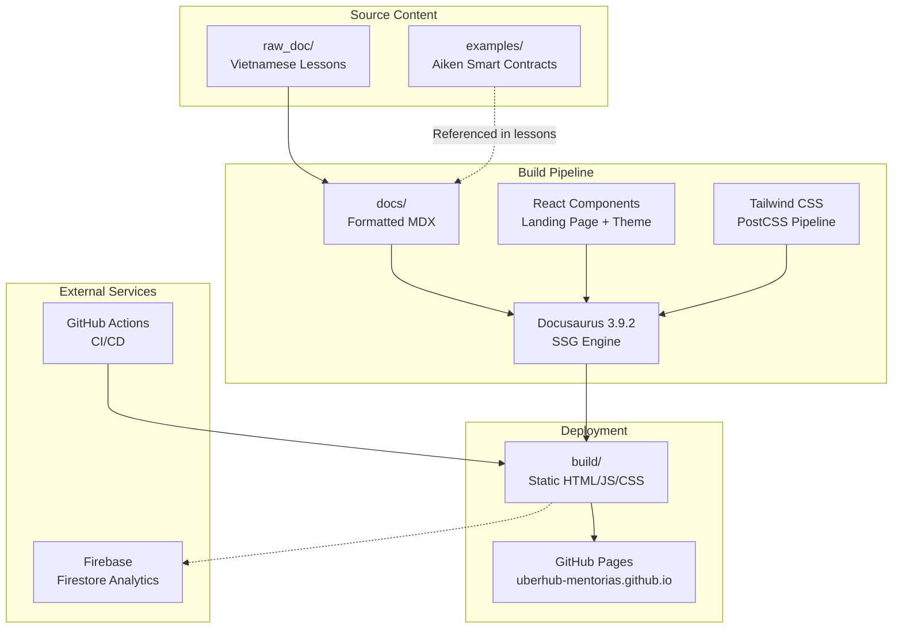
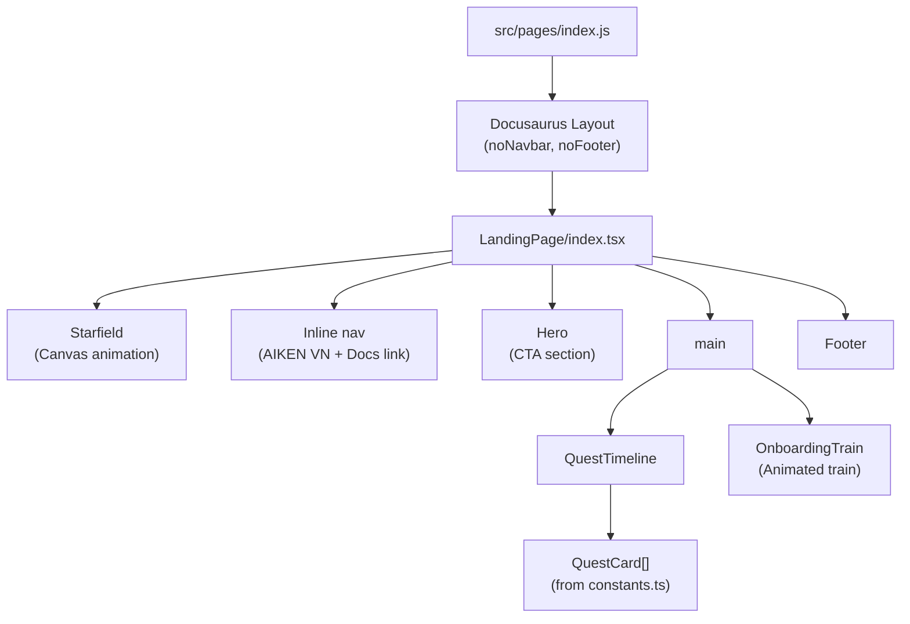
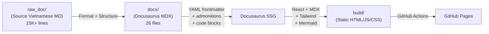
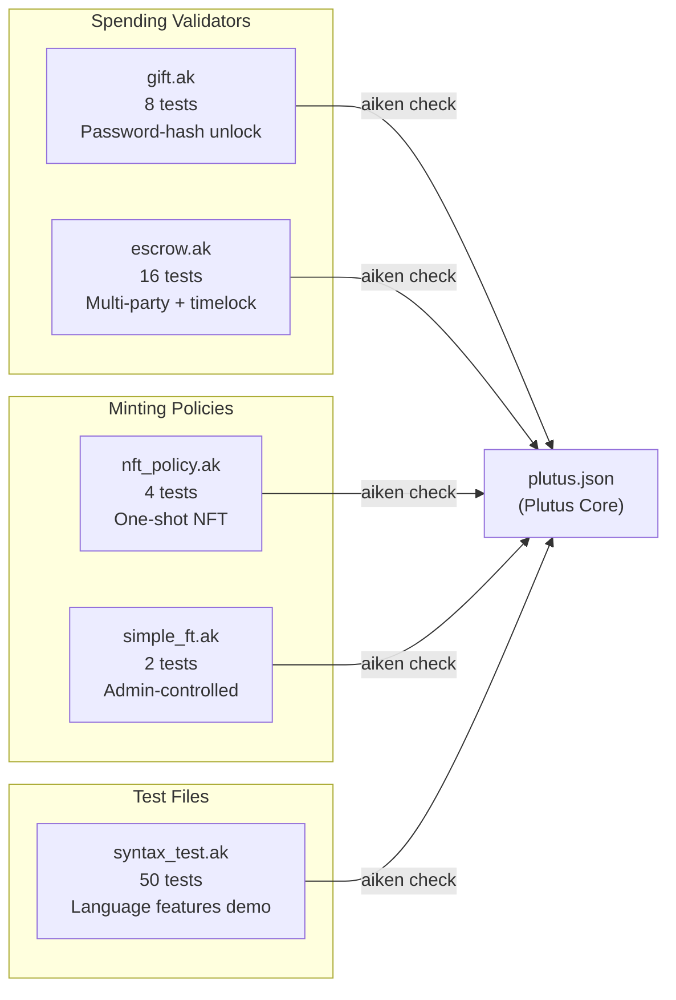
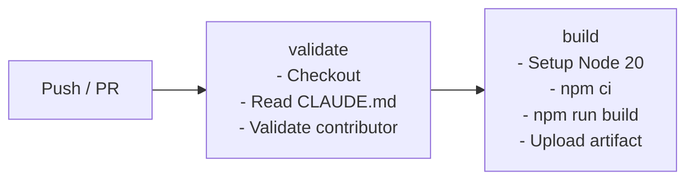
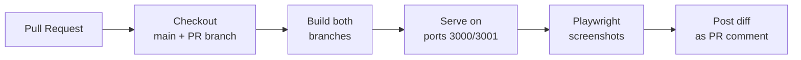
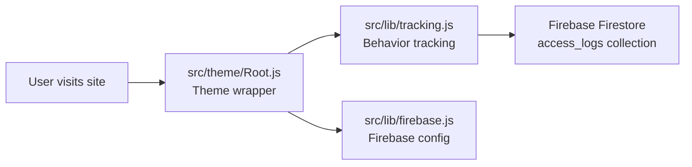
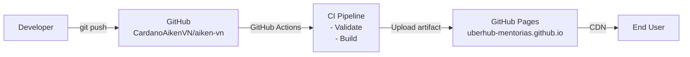

# System Architecture: Vietnamese Aiken

## High-Level Architecture



## Frontend Architecture

The site is a Docusaurus 3.9.2 static site with two distinct rendering modes.

### Homepage (Landing Page)

The homepage bypasses standard Docusaurus chrome with a fully custom React application:



**Supporting modules:**
- `constants.ts` — Quest data and section definitions
- `types.ts` — TypeScript interfaces for component props
- `translations.ts` — UI string translations
- `PixelComponents.tsx` — Reusable pixel-art UI primitives

**Unused components** (built but not rendered): Navbar, Features, Curriculum, Projects, Community.

### Documentation Pages

Documentation pages use standard Docusaurus rendering:
- Auto-generated sidebar from `docs/` directory structure
- Hideable sidebar (`docs.sidebar.hideable: true`)
- Mermaid diagram support via `@docusaurus/theme-mermaid`
- Prism syntax highlighting (Java, Bash, JSON, YAML + defaults)
- Table of contents: headings level 2-4

### Theme Customization

| Layer | File | Purpose |
|-------|------|---------|
| Root wrapper | `src/theme/Root.js` | Injects analytics tracking and sidebar behavior |
| Global CSS | `src/css/custom.css` | Infima variable overrides, Tailwind directives, animations |
| Client module | `src/clientModules/sidebarToggle.js` | Sidebar injection (currently broken) |

## Documentation Processing Pipeline



### Content Processing Steps

1. **Source content** (`raw_doc/`) — Original Vietnamese lesson materials by part
2. **Formatting** (`docs/`) — Content restructured with YAML frontmatter (`title`, `sidebar_position`, `slug`, `description`), Docusaurus admonitions, cross-references, and code examples
3. **Build** — Docusaurus processes MDX through React, applies Tailwind via PostCSS, renders Mermaid diagrams, outputs static HTML
4. **Deploy** — GitHub Actions builds and uploads; GitHub Pages serves result

## Smart Contract Architecture

### Project Structure

```
examples/
├── aiken.toml                    # Project config
├── validators/                   # Source validators
│   ├── gift.ak                   # Spending: password-hash gift
│   ├── escrow.ak                 # Spending: escrow + timelock
│   ├── nft_policy.ak             # Minting: one-shot NFT
│   └── simple_ft.ak              # Minting: admin-controlled FT
├── lib/                          # Tests + syntax demos
│   ├── escrow_test.ak
│   ├── gift_test.ak
│   ├── nft_test.ak
│   ├── simple_ft_test.ak
│   └── syntax_test.ak
└── plutus.json                   # Compiled output
```

### Validator Test Compilation



**Total: 80 tests across 5 test files (8+16+4+2+50)**

### Build and Test Commands

| Command | Purpose |
|---------|---------|
| `aiken fmt` | Format source files (check via `--check` flag) |
| `aiken check` | Type-check and run all 80 tests |
| `aiken build` | Compile validators to Plutus Core (outputs `plutus.json`) |
| `aiken docs` | Generate API documentation |

## CI/CD Pipeline

### Main Build Pipeline (ci.yml)

Triggered on pushes to `main` and `part-*` branches, and on PRs to `main`:



### Visual Regression (before-after.yml)

Triggered on PRs to `main`. Captures before/after screenshots:



**Tools:** `@vercel/before-and-after`, Playwright (Chromium), `npx serve`

### Aiken Tests (reference only)

Located at `examples/.github/workflows/tests.yml` (not triggered by root CI):

```
aiken fmt --check → aiken check → aiken build
```

## Analytics Architecture



Firebase is initialized with client-side configuration. The `tracking.js` module logs user access events to Firestore `access_logs` collection. Analytics injected at theme root via `src/theme/Root.js`.

## Deployment Architecture



| Aspect | Detail |
|--------|--------|
| **Host** | GitHub Pages |
| **URL** | https://uberhub-mentorias.github.io/ |
| **Organization** | uberhub-mentorias |
| **Base URL** | `/` |
| **Build output** | `build/` directory |
| **Node version** | 20 (in CI) |
| **Cache** | npm cache in GitHub Actions |
| **Artifact retention** | 7 days |

## Design System

### Color Palette

| Token | Hex | Usage |
|-------|-----|-------|
| `retro-bg-primary` | `#0F1B2A` | Page background |
| `retro-bg-secondary` | `#112030` | Section backgrounds |
| `retro-bg-card` | `#13253A` | Card surfaces |
| `retro-bg-dark` | `#0a0a0a` | Deepest background |
| `retro-color-cyan` | `#5CE1E6` | Primary accent, links |
| `retro-color-cyan-dark` | `#2BBAC0` | Secondary accent |
| `primary` | `#8f3aff` | Brand purple |
| `primary-glow` | `#b366ff` | Purple glow effects |
| `accent-green` | `#10B981` | Success states |
| `accent-blue` | `#3B82F6` | Information |

### Typography

| Element | Font | Weight |
|---------|------|--------|
| Pixel headings | Press Start 2P | Regular |
| Body text | Arial / Helvetica (system sans-serif) | Regular (400) |
| Bold text | System sans-serif | Bold (700) |

### Animation System

Defined in `tailwind.config.js`:

| Animation | Duration | Use |
|-----------|----------|-----|
| `cloud-slow` | 60s linear infinite | Background clouds |
| `cloud-medium` | 40s linear infinite | Mid-layer clouds |
| `cloud-fast` | 25s linear infinite | Foreground clouds |
| `float` | 4s ease-in-out infinite | Floating elements |
| `pulse-slow` | 4s cubic-bezier infinite | Slow pulse effect |

Additional animations via Framer Motion in individual components (Hero, OnboardingTrain, QuestCard).

### Shadows

| Token | Value | Use |
|-------|-------|-----|
| `glow` | `0 0 15px rgba(255,255,255,0.2)` | Subtle glow on interactive elements |
| `card` | `0 25px 50px -12px rgba(0,0,0,0.5)` | Card elevation |

## Data Models

### Lesson Document Structure

```
docs/{part}/{NN_Title_Name}.md
├── YAML Frontmatter
│   ├── title (Vietnamese)
│   ├── sidebar_position
│   ├── slug (optional)
│   └── description
├── H1 Heading
├── Opening paragraph
├── Learning objectives (bullets)
├── Section content (H2/H3)
├── Code examples (fenced blocks)
├── Summary (bullets)
└── Next lesson link
```

### Quest Timeline Data

Quest data defined in `src/components/LandingPage/constants.ts`:
- Section name and description
- Quest cards (title, description, icon, color, status)
- Position in learning path (parts 1-5)

### Firebase Access Log Schema

```javascript
{
  timestamp: Timestamp,
  sessionId: string,
  userAgent: string,
  pathname: string,
  referrer: string,
  ipInfo: {
    ip: string,
    country: string,
    city: string
  }
}
```

---

**Related documents:**
- [Codebase Summary](./codebase-summary.md)
- [Code Standards](./code-standards.md)
- [Project Overview (PDR)](./project-overview-pdr.md)
